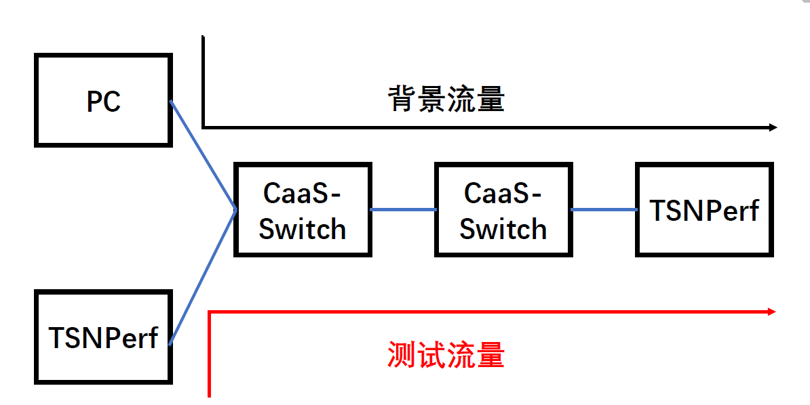
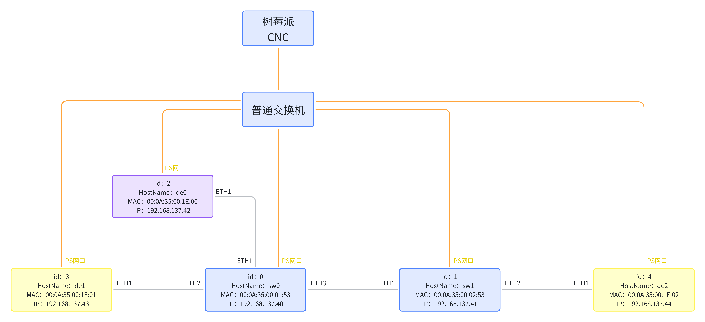

# TestBed Setup Process

## Table of Contents

- [TestBed Setup Process](#testbed-setup-process)
  - [Table of Contents](#table-of-contents)
  - [Introduction to TestBed](#introduction-to-testbed)
  - [Interconnectivity Testing Project Introduction](#interconnectivity-testing-project-introduction)
    - [1. Benchmark Testing](#1-benchmark-testing)
    - [2. Gate Control Capabilities](#2-gate-control-capabilities)
    - [3. Bandwidth Assurance](#3-bandwidth-assurance)
    - [4. Gate Control Precision](#4-gate-control-precision)
  - [Device Parameter Settings and Deployment](#device-parameter-settings-and-deployment)
  - [TestBed Operation Process](#testbed-operation-process)
    - [Preparation](#preparation)
      - [Control Script Preparation](#control-script-preparation)
      - [Background Traffic Sending](#background-traffic-sending)
    - [Benchmark Testing](#benchmark-testing)
    - [Gate Control Capabilities](#gate-control-capabilities)
    - [Bandwidth Assurance](#bandwidth-assurance)
    - [Gate Control Precision](#gate-control-precision)

## Introduction to TestBed

We have conducted interconnectivity tests on our internally developed CaaS-Switch, using the following network topology.



This demo requires 4 FPGA development boards (2 TSNPerf, 2 CaaS-Switch) and 1 standard PC. If resources are limited or a simplified topology is considered, one CaaS-Switch can be omitted. The PC is responsible for sending background traffic, indicated by black arrows; the left TSNPerf sends test traffic (critical traffic), indicated by red arrows.

All test projects generally follow two phases:

1. Time Synchronization: Start time synchronization to ensure TSNPerf and CaaS-Switch are under the same clock domain.
   
   Note: The time synchronization program runs on the TSNPerf and CaaS-Switch systems.

2. Sending Test Traffic: According to the schedule.json file, TSNPerf sends test traffic.

## Interconnectivity Testing Project Introduction

### 1. Benchmark Testing

- Objective: Test the end-to-end delay, packet loss rate, and jitter of high-priority traffic without background traffic as a comparative baseline.
- Expectation: Delay meets the plan, and jitter is low (around 100ns).

### 2. Gate Control Capabilities

- Objective: Test the effect of traffic scheduling under general conditions, and the gate control capabilities between two switches.
- Approach:
  - Background traffic (VLAN priority = 0) is set to line speed, reserving a slot of length 3 for high-priority traffic in each scheduling period.
  1. Send 4 packets of high-priority (VLAN priority = 1) test traffic each cycle, each packet 1500Bytes, recording end-to-end average delay, jitter, packet loss rate, and arrival order.
  2. Send 8 packets of high-priority (VLAN priority = 1) test traffic each cycle, recording if only n packets pass each cycle.
- Expectations:
  1. Delay, jitter, and packet loss rate consistent with the baseline.
  2. When sending 4 packets per cycle, packet loss rate is 0.
  3. When sending 8 packets per cycle, only 5 packets pass each cycle (every 8 packets drop 3, as exactly the fifth packet can be sent out in each slot, the remaining three packets are dropped), packet loss rate is 37.5%.

### 3. Bandwidth Assurance

- Objective: Test the switch's ability to reserve bandwidth and that the priority mapping, operation cycle, and offset of the two switches are essentially consistent.
- Approach:
  - Background traffic (VLAN priority = 0) is set to line speed (1Gbps), configuring the switch to reserve 50% of the slot for high-priority traffic (VLAN priority = 1), the other 50% only allows low-priority traffic.
  1. High-priority (VLAN priority = 1) test traffic is set to line speed (tests show that sending 2752 packets of 1500B each cycle [33ms] nearly reaches 1000Mbps), recording end-to-end average delay, jitter, packet loss rate, and arrival order.
  2. High-priority (VLAN priority = 1) test traffic is set to 50% line speed (sending 1376 packets of 1500B each cycle [33ms]), recording end-to-end average delay, jitter, packet loss rate, and arrival order.
- Expectations:
  1. High-priority test traffic at 100% line speed: Delay and jitter consistent with the baseline, packet loss rate around 50%.
  2.

 High-priority test traffic at 50% line speed: Delay and jitter consistent with the baseline, 0 packet loss rate.

### 4. Gate Control Precision

- Objective: Test the setting precision of gate control slot length.
- Approach: (n=1,2,4,8,...)
  1. Reserve a slot of length 1 for high-priority traffic each scheduling period.
  2. Send n packets of high-priority (VLAN priority = 1) test traffic each cycle, each packet length of 1/n*1500Byte, recording if n packets pass each cycle.
     - n=1,
- Expectations:
  1. In cases n=1,2,4,8, all packets pass each cycle.

> If you use our open-source ZIGGO switch and TSNPerf as configured below, you can achieve effects similar to the expected outcomes in the four tests above. If any issues arise, feel free to raise an issue on GitHub.

## Device Parameter Settings and Deployment

Switch software and hardware code is available in the repository [ZIGGO-Caas-Switch](https://github.com/mobisense/Ziggo-CaaS-Switch), use the main branch.

TSNPerf's software and hardware code are in this repository.

> Note: For bandwidth capability testing, TSNPerf must use the offline_analyze branch; for gate control precision testing, TSNPerf must use the packet_resize branch [for customizing test packet size]. Do not forget to switch branches during testing.

All devices' IP, MAC, and ID are shown below, corresponding to the JSON configuration file provided later:



The corresponding config file can be seen in `config.json`.

## TestBed Operation Process

### Preparation

#### Control Script Preparation

Refer to [CNC-User-Manual](/ziggo_book/docs/device/cnc_manual/)

#### Background Traffic Sending

Can be directly executed on a Linux PC using the `send.py` script (requires installing scapy, tcpreplay).

### Benchmark Testing

Switch and TSNPerf both use the main branch.

Testing Steps:

1. Modify batch.mjs to the correct configuration file name.
2. ./batch.mjs pull (ensure correct branch).
3. ./batch.mjs distribute:
   - Each Device sends 4 packets, each Switch reserves 3 slots, distribute the following two configuration files:
     - `base/d3s2-baseline-3t-config.json`,
     - `base/d3s2-baseline-3t-schedule-base.json`.
4. ./batch.mjs launch (includes time synchronization and packet sending).
5. ./batch.mjs collect.

### Gate Control Capabilities

Switch and TSNPerf both use the main branch.

1. Enable background traffic Device to send packets (not required for benchmark testing).
2. Modify batch.mjs to the correct configuration file name.
3. ./batch.mjs pull (ensure correct branch).
4. ./batch.mjs distribute:
   - Device1 sends 4 packets each time, each Switch reserves 3 slots, distribute the following two configuration files:
     - `gate/d3s2-baseline-3t-config.json`,
     - `gate/d3s2-baseline-3t-schedule-gate.json`.
5. ./batch.mjs launch.
6. ./batch.mjs collect.
7. Modify the schedule.json in the above to change the number of packets sent by Device from 4 to 8, then retest from step 4 above, the modified schedule.json is shown below:

```json
{
    "type": "link",
    "from": 3,
    "to": 0,
    "from_port": 0,
    "id": 7,
    "schedule": [
        {
            "period": 2048,
            "start": 0,
            "end": 8,
            "job_id": 1,
            "flow_id": 1
        }
    ]
},
```

### Bandwidth Assurance

Switch uses the main branch, TSNPerf uses the offline_analyze branch.

Testing Steps:

1. Enable background traffic Device to send packets (not required for benchmark testing).

2. Modify batch.mjs to the correct configuration file name.

3. ./batch.mjs pull (ensure correct branch).

4. ./batch.mjs distribute:
   - Device1 sends 1376 packets each time, each Switch reserves 1024 slots, distribute the following two configuration files:
     - `bandwidth/d3s2-baseline-50%t-config.json`,
     - `bandwidth/d3s2-baseline-50%t-schedule.json`.

5. ./batch.mjs launch.

6. Use offline analysis.

7. Modify the schedule.json in the above to change the number of packets sent by Device from 1376 to 2752, then retest from

 step 4 above, the modified schedule.json is shown below:
   
   ```json
   {
    "type": "link",
    "from": 3,
    "to": 0,
    "from_port": 0,
    "id": 7,
    "schedule": [
        {
            "period": 2048,
            "start": 0,
            "end": 2752,
            "job_id": 1,
            "flow_id": 1
        }
    ]
   },
   ```

### Gate Control Precision

Switch uses the main branch, TSNPerf uses the packet_resize branch.

1. Modify batch.mjs to the correct configuration file name.

2. ./batch.mjs pull (ensure correct branch).

3. ./batch.mjs distribute:
   - Device1 sends 1 packet of 1500B each time, each Switch reserves 1 slot, distribute the following two configuration files:
     - `accuracy/d3s2-baseline-1t-config.json`,
     - `accuracy/d3s2-baseline-1t-schedule.json`.

4. ./batch.mjs launch.

5. ./batch.mjs collect.

6. Modify the schedule.json in the above to change the number of packets sent by Device from 1 to 2, 4, 8 respectively, and the packet size to 750, 375, and 187 respectively, then retest from step 4 above, the modified schedule.json for sending 2 packets is shown below:
   
   ```json
   {
    "type": "link",
    "from": 3,
    "to": 0,
    "from_port": 0,
    "id": 7,
    "schedule": [
        {
            "period": 2048,
            "start": 0,
            "end": 2, 
            "pkt_size": 750, // 1500/2 = 750 
            "job_id": 1,
            "flow_id": 1
        }
    ]
   },
   ```