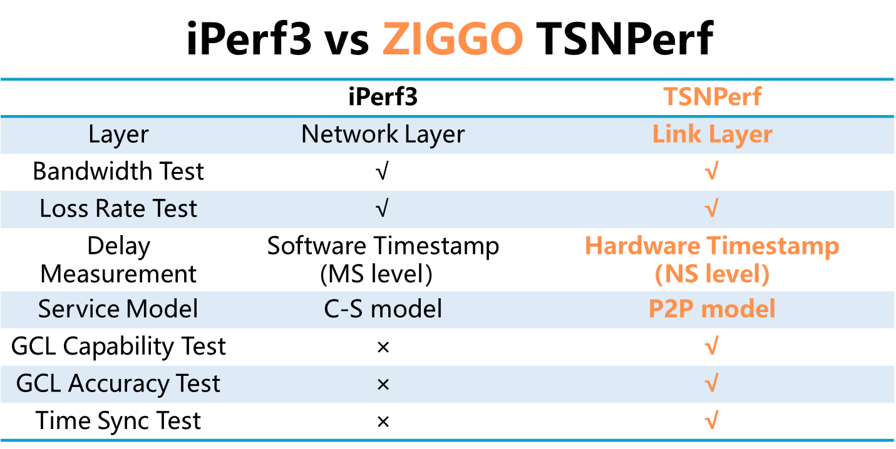

<div align="center">

# ZIGGO TSNPerf: A flexible, comprehensive and user-friendly TSN evaluation toolkit.

</div>

<h3 align="center">
    <a href="http://tns.thss.tsinghua.edu.cn/ziggo/">Project Page</a> |
    <a href="https://ieeexplore.ieee.org/document/10228980">Paper</a> |
    <a href="https://github.com/Horacehxw/Ziggo-CaaS-Switch">ZIGGO-CaaS-Switch</a> |
    <a href="https://github.com/Horacehxw/Ziggo-Evaluation-Toolkit">ZIGGO-Device</a>
</h3>


## Table of Contents

- [ZIGGO TSNPerf: A flexible, comprehensive and user-friendly TSN evaluation toolkit.](#ziggo-tsnperf-aflexiblecomprehensive-and-user-friendlytsn-evaluation-toolkit)
  - [Table of Contents](#table-of-contents)
  - [Introduction](#introduction)
  - [Features](#features)
  - [Getting Started](#getting-started)
  - [Test Case](#test-case)
  - [License and Citation](#license-and-citation)
  - [Contributing](#contributing)
  - [Acknowledgement](#acknowledgement)


## Introduction

ZIGGO is a `flexible`, `standard-compliant`, and `control-function-virtualized` TSN switch platform ready for **industrial control**, **automotive electronics**, and other **time-sensitive applications**.

This is the document for the ZIGGO TSNPerf.
ZIGGO TSNPerf is a flexible, comprehensive and user-friendly TSN evaluation toolkit.
It provides protocol compliance assesment and network performance evaluation.
The following figure illustrates the similarities and differences between ZIGGO TSNPerf and iPerf3.



## Features

ZIGGO TSNPerf provides protocol compliance assesment and network performance evaluation.
It is an all-round hardware-software integrated solution, including

* **Time synchronization test:**
Accurate timestamp (up to 8ns), time synchronization accuracy and protocol consistency analysis

* **Traffic shaping test:**
(1) Precise replay and recording of critical traffic, and
(2) GCL capability, bandwidth guarantee and GCL accuracy testing

* **Network Configuration Testing:**
(1) Qcc configuration capability and data model consistency analysis, and
(2) TSN traffic automatic scheduling and results verification

## Getting Started

Please refer to TSNPerf [documents](/ziggo_book/docs/tsnperf/configuration/) to get prepared.

## Test Case

We exploit ZIGGO TSNPerf to conduct a comprehensive test on a Brand A TSN switch.
The following figures show the test results for GCL capability, bandwidth guarantee, and GCL accuracy for the Brand A switch.
The results reveal that the Brand A TSN switch provides high-priority resource reservation (i.e., gating capability) and bandwidth guarantees for critical traffic, 
but its GCL accuracy is low, failing to meet the requirements of the IEEE 802.1Qbv protocol.


  


For more details of this test case, please refer to the [test report](http://tns.thss.tsinghua.edu.cn/ziggo/data/switch_report.pdf).

## License and Citation

ZIGGO is released under a [MIT license](). 

Please consider citing our papers if the project helps your research with the following BibTex:

```bibtex
@inproceedings{caas,
  author={Yang, Zheng and Zhao, Yi and Dang, Fan and He, Xiaowu and Wu, Jiahang and Cao, Hao and Wang, Zeyu and Liu, Yunhao},
  booktitle={IEEE INFOCOM 2023 - IEEE Conference on Computer Communications},
  title={CaaS: Enabling Control-as-a-Service for Time-Sensitive Networking},
  year={2023},
  pages={1-10},
  doi={10.1109/INFOCOM53939.2023.10228980}
}
```

```bibtex
@inproceedings{etsn,
  author={Zhao, Yi and Yang, Zheng and He, Xiaowu and Wu, Jiahang and Cao, Hao and Dong, Liang and Dang, Fan and Liu, Yunhao},
  booktitle={IEEE ICDCS 2022 - IEEE International Conference on Distributed Computing Systems}, 
  title={E-TSN: Enabling Event-triggered Critical Traffic in Time-Sensitive Networking for Industrial Applications}, 
  year={2022},
  volume={},
  number={},
  pages={691-701},
  doi={10.1109/ICDCS54860.2022.00072}}
```

## Contributing

Please see the guide for information on how to ask for help or contribute to the development of ZIGGO!

> The development team will only answer questions on github issues and reject other forms of questions.

## Acknowledgement

This project references parts of the Intel [iotg](https://github.com/intel/iotg_tsn_ref_sw) repository.
