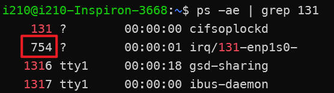

# TSNPerf User Guide

## Hardware Preparation
Prepare two machines, one as the sender (Publisher) and the other as the receiver (Recorder), each equipped with the following hardware requirements:
* Intel processor, 8th generation or above
* Intel I210 / I225-LM / I225-LM network cards

**Note**: The Publisher should have two network cards installed—one for time synchronization and the other for sending packets. The Recorder only needs one network card, which will handle both time synchronization and data reception.

## System Preparation
Install the following systems and software dependencies on both the sender and receiver machines:
* Install Ubuntu 22.04
* Install Intel ECI: https://eci.intel.com/docs/3.1/getstarted/requirements.html
* Install linuxPTP, see the next section
* Install dependencies:
```shell
sudo apt-get install libconfig-dev libpcap-dev
```
Before starting the experiment, ensure that the devices to be tested are properly connected to the Publisher and Recorder and that the machines are powered on.

## Enable Time Synchronization

### Installing linuxPTP
#### 1. Install the Network Card Driver
Download the driver from [Intel's website](https://www.intel.com/content/www/us/en/download/14098/intel-network-adapter-driver-for-82575-6-82580-i350-and-i210-211-based-gigabit-network-connections-for-linux.html) and follow the tutorial in the README file to compile and install the driver.

Use the following command to check the installation (`enp3s0` is the network card name). If installed correctly, you should see the output highlighted in the red box below (indicating that the network card has hardware timestamp capabilities):
```shell
ethtool -T enp3s0
```


#### 2. Install linuxPTP
Install linuxPTP with the following commands:
```shell
git clone http://git.code.sf.net/p/linuxptp/code linuxptp
cd linuxptp/
make
sudo make install
```

### Synchronize the Clocks of Publisher and Recorder's Network Cards
Use the following command to start time synchronization on the network cards of both the Publisher and Recorder. Replace `enp3s0` with your network card name and `<configuration>.cfg` with a configuration file based on the examples in `linuxptp/configs/` and customized to your requirements.
```shell
sudo ptp4l -i enp3s0 -f <configuration>.cfg -m -l 6 --socket_priority 7
```
**Note**: If necessary, also start the time synchronization function on the device under test.

### Synchronize Network Card Clocks with the System Clock
After synchronizing the network cards of the Publisher and Recorder, synchronize their clocks with the system clock as well.
```shell
sudo phc2sys -c CLOCK_REALTIME -s enp3s0 -O -0 -m -l 6
```
Since the Publisher uses separate network cards for time synchronization and packet sending, synchronize the sending network card's clock with the system as well:
```shell
sudo phc2sys -s CLOCK_REALTIME -c enp1s0 -O -0 -m -l 6
```

## Optimize the Network Stack

### Bind Critical Traffic to Queue 0
Execute the following commands on both the Publisher and Recorder to bind critical traffic to Queue 0.
```shell
sudo ethtool --config-ntuple enp1s0 delete 15
sudo ethtool --config-ntuple enp1s0 flow-type ether proto 0xb62c loc 15 action 0
sudo ethtool -X enp1s0 equal 2
```
**Note**:
1. `enp1s0` represents the network card on the Publisher responsible for sending packets or the network card on the Recorder.
2. The `0xb62c` in the second line is the ethertype for critical traffic; ensure it matches the `ethertype` specified in the next section.

### Bind Queue 0 Interrupts to Isolated Cores and Set Priority
Execute the following commands on both the Publisher and Recorder.

**Bind to Isolated Cores**
```shell
cat /proc/interrupts | grep TxRx-0
```


```shell
sudo sh -c "echo 2 > /proc/irq/131/smp_affinity"
```
**Set Priority**
```shell
ps -ae | grep 131
```



```shell
sudo chrt -fp 95 
```

### Enable LaunchTime Feature
Enable the LaunchTime feature on

 the Publisher:
```shell
sudo tc qdisc add dev enp1s0 handle 8001: parent root mqprio num_tc 4 map 0 1 2 3 3 3 3 3 3 3 3 3 3 3 3 3 queues 1@0 1@1 1@2 1@3 hw 0
sudo tc qdisc replace dev enp1s0 parent 8001:1 etf offload clockid CLOCK_TAI delta 500000
```

## Modify Configuration Files
Modify the configuration file according to your testing needs. Here is an example configuration `default.ini`:
```bash
mode:                   0
tx-mode:                0
verbose:                true
use-ziggo-analysis:     false
pcap-filename:          "/home/i210/launchtimedemo/captured_10w_1500Byte.pcap"
interface:              "enp1s0"
smac:                   "00:1b:21:77:ac:ae"
dmac:                   "00:1b:21:76:ae:75"
ethertype:              0xb62c
socket-priority:        0
vlan-priority:          0
offset:                 150000
early-offset:           300000
use-launchtime:         true
basetime:               1684559640000000100L
packet-size:            1500
packets-to-send:        100000
interval:               1000000
use-udp:                true
sip:                    "192.168.16.10"
dip:                    "192.168.16.11"
sport:                  10000
dport:                  10000
```

## Launch the Receiving Program on the Publisher
The receiving program can use Intel's [txrx-tsn](https://github.com/intel/iotg_tsn_ref_sw) in reception mode, paired with `use-ziggo-analysis = false`, to directly obtain the packet's sending and receiving timestamps. However, conflicts with iperf during background traffic tests have been observed. Consider using tcpdump to capture packets and save high-precision rx timestamps. Tx timestamps can be obtained from the sender's program output for analysis.
```shell
sudo tcpdump -i <network interface> ether proto 0xb62c -j adapter_unsynced --time-stamp-precision=nano -s 0 -tttt -w <path to save pcap file>
```

## Launch the Sending Program on the Recorder

```shell
cd /path/to/launchtimedemo
make
sudo taskset -c 1 chrt -f 92 ./tsnperf -c ~/launchtimedemo/config.ini
```