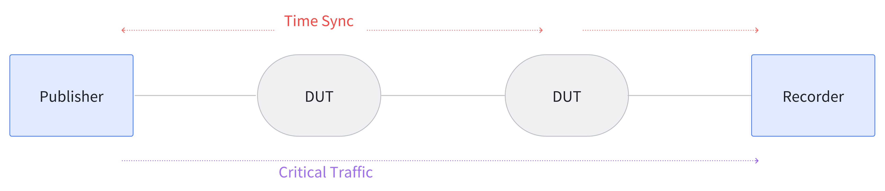

# TSNPerf Test Content and Usage Table
## Traffic Shaping Test

This section introduces the method for testing the traffic shaping capabilities of the device under test using TSNPerf. The testing parameters provided in this section are reference configurations and can be modified by users according to actual needs.

### Benchmark Test

**Purpose:** To test the end-to-end delay, jitter, and packet loss of high-priority traffic through a single-hop switch (device under test) **without** background traffic.

**Approach:**
Use the following topology to send critical packets as described in the configuration document and record the end-to-end latency, jitter, and packet loss rate of the critical packets.


Here is a reference parameter configuration for the TSNPerf program:
```bash
mode:                   0
tx-mode:                2
verbose:                true
use-ziggo-analysis:     false
pcap-filename:          "/home/i210/launchtimedemo/captured_10w_1500Byte.pcap"
interface:              "enp1s0"
smac:                   "00:1b:21:77:ac:ae"
dmac:                   "00:1b:21:76:ae:75"
ethertype:              0xb62c
socket-priority:        0
vlan-priority:          0
offset:                 150000
early-offset:           300000
use-launchtime:         true
basetime:               1684559640000000100L
packet-size:            1500
packets-to-send:        10000
interval:               1000000
use-udp:                false
sip:                    "192.168.16.10"
dip:                    "192.168.16.11"
sport:                  10000
dport:                  10000
```

In this configuration, `packet-size` can be changed as needed, with recommended settings of 64 Byte (minimum Ethernet frame length), 100 Byte, 500 Byte, 1000 Byte, 1500 Byte, etc.

Each critical packet starts with an 8-byte timestamp from the 26th byte, captured using tcpdump to record the corresponding receive timestamp, thus calculating the end-to-end latency for each packet. By analyzing 10,000 packets sent, average latency and jitter (variance/standard deviation) as well as packet loss rate can be determined.

### Gate Control Capabilities

**Purpose:** To test the end-to-end delay, jitter, and packet loss rate of high-priority traffic through a single-hop switch (device under test) **with** background traffic.

**Approach:** Use the following topology for testing. Send background traffic from the Injector to the Recorder while simultaneously sending critical traffic from the Publisher to the Recorder, and record the end-to-end latency, jitter, and packet loss rate of the critical packets.


To comprehensively test the gate control capabilities of the device under test, adjust the bandwidth of the background traffic injected into the network. For a gigabit network, for instance, examine the conditions where the background traffic is 250 Mbps, 500 Mbps, 750 Mbps, and 1000 Mbps to see how it affects the delay and jitter of the critical packets.

The configuration parameters for the TSNPerf program can be referred to the previous section. If the device functions normally, the test results should be consistent with those obtained in the **Benchmark Test**.

### Gate Control Precision

**Purpose:** To test the precision of the switch's gate control, i.e., whether it can pass the expected number and size of Ethernet frames.

**Approach:** Each cycle reserves a gate control of 16384ns for critical traffic, theoretically allowing 2 packets of 1500Byte Ethernet frames per cycle.

Below is a reference parameter configuration for the TSNPerf program:
```bash
mode:                   0
tx-mode:                3
verbose:                true
use-ziggo-analysis:     false
pcap-filename:          "/home/i210/launchtimedemo/captured_10w_1500Byte.pcap"
interface:              "enp1s0"
smac:                   "00:1b:21:77:ac:ae"
dmac:                   "00:1b:21:76:ae

:75"
ethertype:              0xb62c
socket-priority:        0
vlan-priority:          0
offset:                 150000
early-offset:           300000
use-launchtime:         false
basetime:               1684559640000000100L
packet-size:            1500
packets-to-send:        100000
interval:               1000000
use-udp:                false
sip:                    "192.168.16.10"
dip:                    "192.168.16.11"
sport:                  10000
dport:                  10000
```

The Publisher sends full critical traffic to the Recorder, and the Recorder records the timestamps of the received critical packets. It is expected that two critical packets per cycle (1 millisecond) are received.

Additionally, the gate control precision of the device can be verified on different topologies with finer granularity. In the topology shown below, for example, with a gigabit Ethernet and 1500Byte test packets, we configure DUT1 to open the critical traffic gate from 0~16us and DUT2 from 15~31us per cycle. The critical packets are expected to pass through the network devices without loss, and the end-to-end delay should be consistent with the results when gates are fully open.



### Bandwidth Assurance

**Purpose:** To test whether the switch under test can reserve fixed bandwidth for critical traffic.

**Approach:**
1. Configure the gate control of the test switch to reserve 25%, 50%, and 75% of the bandwidth for critical data.
2. Send full background traffic from the Injector to the Recorder.
3. Use TSNPerf to send critical traffic from the Publisher to the Recorder, with configuration parameters referable to the previous section.
4. Record the bandwidth usage at the Recorder using tcpdump/wireshark. For a gigabit bandwidth, it is expected that the critical data will occupy bandwidths of 250Mbps, 500Mbps, and 750Mbps respectively.

### Video Traffic Test

**Purpose:** To test the end-to-end delay, jitter, and packet loss rate of video traffic with different Ethernet frame sizes through a single-hop switch.

**Approach:** The test topology refers to the **Benchmark Test** section. Prepare a video traffic pcap file `H264.pcap`, with TSNPerf program parameters configured as follows:
```bash
mode:                   0
tx-mode:                0
verbose:                true
use-ziggo-analysis:     false
pcap-filename:          "/home/i210/launchtimedemo/H264.pcap"
interface:              "enp1s0"
smac:                   "00:1b:21:77:ac:ae"
dmac:                   "00:1b:21:76:ae:75"
ethertype:              0xb62c
socket-priority:        0
vlan-priority:          0
offset:                 150000
early-offset:           300000
use-launchtime:         true
basetime:               1684559640000000100L
packet-size:            1500
packets-to-send:        10000
interval:               1000000
use-udp:                true
sip:                    "192.168.16.10"
dip:                    "192.168.16.11"
sport:                  10000
dport:                  10000
```
If the switch under test is a store-and-forward mode, the end-to-end delay of each packet is expected to vary with the size of the packet. If the switch is a cut-through mode, the jitter in the end-to-end delay of the packets is expected to be minimal.

## Summary of Hyperparameters

In addition to the TSNPerf program configurations given above, there are some parameters in the test cases that often need to be adjusted according to requirements, now summarized below:

* packet-size: This parameter sets the size of the test packet, used to verify the device's ability to forward different packet sizes. Recommended configurations include: 64 Byte (minimum Ethernet frame length), 100 Byte, 500 Byte, 1000 Byte, 1500 Byte, etc.
* Background traffic size: This parameter sets the size of background traffic in the network, used to verify whether the device can ensure low latency and low jitter transmission of critical traffic. Depending on the actual network bandwidth size, configure the background traffic to occupy 0%, 25%, 50%, 75%, 100% of the network bandwidth.
* Topology: The topology determines the path of critical traffic in the network. Testing on different topologies can more comprehensively verify the device's gate control capabilities and gate control precision. Due to space limitations, this article only uses a one-hop