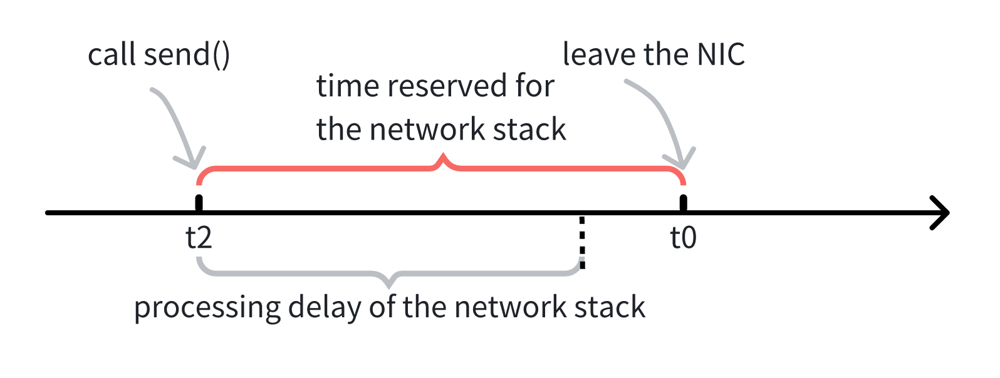

# TSNPerf Design Principles
## Limitations of Existing Solutions

TSNPerf is a performance evaluation tool specifically designed for Time-Sensitive Networking (TSN). It provides comprehensive performance evaluation capabilities for TSN networks, helping network engineers and researchers to deeply understand and verify the performance characteristics of TSN network devices. For this purpose, TSNPerf needs to be able to precisely send critical packets into the network to test the devices' time synchronization performance and traffic shaping capabilities. However, the `send()` function provided by the Linux operating system can only achieve microsecond-level packet sending precision, which is insufficient for TSNPerf's high-precision requirements.

To visually demonstrate the packet sending precision limitations of the `send()` function, we conducted a test. In this test, we used the `send()` function to continuously send 10,000 packets at a set interval of 1 millisecond. We then recorded the actual time intervals between each pair of adjacent packets and calculated the deviation from the expected 1 millisecond interval. The results showed that even without any background processes/traffic interference, the intervals between adjacent packets still reached up to ***approximately 14 microseconds***. We next analyze the cause of this phenomenon.

As shown in the diagram below, at time  t_0 , the program calls the `send()` function to send a packet to the network, but in reality, the packet is not sent until time  t_1 . This is because the operating system's network stack requires time to process the packet. We refer to the delay from  t_1-t_0  as the network stack's processing delay, which is typically on the order of microseconds.

## Solution

Intel's I210 / I225 / I226 network cards provide the LaunchTime feature, which allows precise control over the timing of packets leaving the network interface (theoretical precision at the 32-nanosecond level).

Using LaunchTime, we can enhance the precision of packet transmission. As shown in the diagram above, for a packet that needs to be sent at time  t_0 , we reserve a period for the network stack's processing and call the `send()` function ahead of time at  t_2  to ensure the packet is waiting in the network card's output queue before  t_0 . LaunchTime then opens the output queue gate at  t_0  to send the packet.

## Performance Validation

Similarly, with the LaunchTime feature enabled, we continuously sent 10,000 packets at a set interval of 1 millisecond and recorded the actual intervals between each pair of packets along with the deviation from 1 millisecond. As shown in the results below, the sending time errors of all packets did not exceed 100 nanoseconds, meeting TSNPerf's precision requirements for packet transmission.

