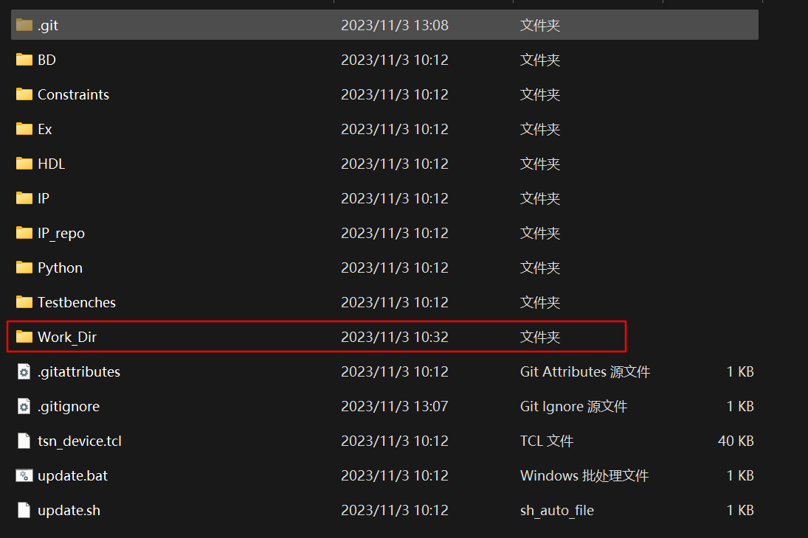

# 硬件构建
## 开始前

如果您只想让开发板运行而不进行修改，并且使用我们提供的硬件文件，可以直接跳到步骤 [SD 卡分区和文件复制](#6-sd-card-partition-and-copy-file)。

## 目录

- [硬件构建](#硬件构建)
  - [开始前](#开始前)
  - [目录](#目录)
  - [安装 Vivado](#安装-vivado)
  - [Vivado 项目构建](#vivado-项目构建)
  - [Petalinux](#petalinux)
    - [1. 安装 Ubuntu 操作系统](#1-安装-ubuntu-操作系统)
    - [2. 预先下载 PetaLinux 相关镜像文件](#2-预先下载-petalinux-相关镜像文件)
    - [3. 激活 PetaLinux 环境](#3-激活-petalinux-环境)
    - [4. 创建 PetaLinux 项目](#4-创建-petalinux-项目)
    - [5. PetaLinux 配置](#5-petalinux-配置)
    - [6. SD 卡分区和文件复制](#6-sd-卡分区和文件复制)
      - [文件下载](#文件下载)
      - [SD 卡分区](#sd-卡分区)
      - [复制文件到 SD 卡](#复制文件到-sd-卡)
  - [启动开发板并登录](#启动开发板并登录)
    - [1. 启动开发板](#1-启动开发板)
    - [2. 初始化 PS](#2-初始化-ps)
    - [3. 连接到互联网](#3-连接到互联网)
    - [4. 运行软件](#4-运行软件)

## 安装 Vivado

您可以在 [这里](https://www.xilinx.com/products/design-tools/vivado.html) 下载 Vivado。

我们使用的是 Vivado 2020.1 版本（注意：需要统一版本，否则运行可能会出现问题）。

## Vivado 项目构建

1. 克隆硬件部分的 git 仓库。
2. 打开 Vivado 并在 Tcl 控制台中输入命令 `cd Project_Dir` 和 `source ./tsn_device.tcl`。命令执行后，Vivado 将自动打开创建的项目。此时，我们将先关闭 Vivado 并将项目所在文件夹重命名为 `Work_Dir`，以便 git 可以正确忽略该目录，然后进入 `Work_Dir`，双击 `.xpr` 文件再次打开项目。




3. 点击 `Generate Bitstream`


4. 导出 xsa 文件。在 Vivado 中，选择 File Export Export Hardware。平台类型选择 Fixed。输出选择 include bitstream。点击 Finish 导出 xsa 文件。

   导出的 xsa 文件路径：`Work_Dir/tns+tsn_device.xsa`

## Petalinux

### 1. 安装 Ubuntu 操作系统

以下编译过程均在虚拟机中完成。

我们推荐使用以下配置：

```
虚拟机版本：VMware Workstation 16 Pro
Ubuntu 版本：ubuntu-16.04.3-desktop-amd64.iso
```

### 2. 预先下载 PetaLinux 相关镜像文件

进入网站：https://www.xilinx.com/support/download/index.html/content/xilinx/en/downloadNav/embedded-design-tools/archive.html

选择 2020.1 找到 `PetaLinux Tools sstate-cache artifacts` 并下载 `sstate_arm_2020.1` 和 `downloads`，并将下载的文件保存在虚拟机的指定目录（本文档中的目录设置为 /home/alinx/data/）

​    

### 3. 激活 PetaLinux 环境

```bash
source /opt/pkg/petalinux/settings.sh
```

​    每次启动终端时自动激活 PetaLinux 环境。

### 4. 创建 PetaLinux 项目

```bash
petalinux-create --type project --template zynq --name <project_name>
cd <project_name>
```

### 5. PetaLinux 配置

1. 导入硬件配置

```bash
petalinux-config --get-hw-description <PATH-TO-XSA Directory>
```

然后您将进入 menuconfig 页面，按照以下配置：

```
Subsystem AUTO Hardware Settings
-> Ethernet Settings  
  -> [*] Randomise MAC address

Image Packaging Configurations 
-> Root filesystem type 
  -> [*] EXT4 (SD/eMMC/SATA/USB)

Yocto Settings (Use downloaded image)
-> Local sstate feeds settings: /home/alinx/data/sstate_arm_2020.1/arm
-> Add pre-mirror url: file:///home/alinx/data/downloads
```

2. 制作 `Kernel Module`

​    制作一个名为 "`dma proxy`" 的模块：

```bash
petalinux-create -t modules -n dma-proxy --enable
```

​    替换 dma-proxy 文件夹：

```bash
rm -rf project-spec/meta-user/recipes-modules/*
```

下载我们的 dma-proxy（从 [这里](https://cloud.tsinghua.edu.cn/f/85cfd8e8174e4689b79b/)）并解压到 `project-spec/meta-user/recipes-modules/` 目录中。

3. 配置内核

```bash
petalinux-config -c kernel
```

进入 `menuconfig` 页面，进行以下配置：

```bash
Device Drivers 
-> Userspace I/O drivers 
  -> [*] Userspace I/O platform driver with generic IRQ handling 
  -> [*] Userspace platform driver with generic irq and dynamic memory 
  -> [*] Xilinx AI Engine driverDevice Drivers 
-> Dma Engine Support  
  -> [*] Xilinx DMA Engines
-> Network device support    
  -> Ethernet driver support        
    -> [*] Cadence devices        
    -> [*] Cadence MACB/GEM support

General setup 
-> Preemption Model    
  -> (X) No Forced Preemption (Server)
```

4. 配置 rootfs

编辑文件 `project-spec/meta-user/conf/user-rootfsconfig`，并***添加***以下配置：

```bash
CONFIG_sudo
CONFIG_sudo-dev
CONFIG_dnf
CONFIG_packagegroup-core-buildessential
CONFIG_packagegroup-core-buildessential-dev
CONFIG_packagegroup-self-hosted
CONFIG_packagegroup-self-hosted-dev
CONFIG_packagegroup-self-hosted-sdk-dev
CONFIG_packagegroup-self-hosted-sdk
CONFIG_python3
CONFIG_autoconf
CONFIG_autoconf-dev
CONFIG_automake
CONFIG_automake-dev
CONFIG_bison
CONFIG_bison-dev
CONFIG_flex
CONFIG_flex-dev
CONFIG_make
CONFIG_make-dev
CONFIG_python
CONFIG_libtool
CONFIG_libtool-dev
CONFIG_sqlite3
CONFIG_cmake
CONFIG_util-linux
CONFIG_net-tools
```

保存并退出。

输入：

```bash
petalinux-config -c rootfs
```

然后您将进入 menuconfig 页面，按照以下配置：

```
Image Features 
-> [*] package management   
  -> (http://petalinux.xilinx.com/sswreleases/rel-v2020/feeds/zc702-zynq7/) Package feed url.
user packages
-> SELECT ALL
```

5. 编译设备树

```bash
petalinux-build -c device-tree
```

6. 修改设备树

生成的设备树位于 `components/plnx_workspace/device-tree/device-tree/pl.dtsi` 目录，我们需要基于该文件进行修改以满足我们的一些外设需求。修改后的文件存储在 `project-spec/meta-user/recipes-bsp/device-tree/files/system-user.dtsi` 目录中。

> 注意：在 `//>>>` 和 `//<<<` 之间是注释中添加的内容。

```C
/include/ "system-conf.dtsi"
/ {
        amba_pl: amba_pl {
                dma_proxy {  
            compatible ="xlnx,dma_proxy";
            dmas = <&axi_dma_0 0  &axi_dma_0 1>;
            dma-names = "dma_proxy_tx", "dma_proxy_rx";  
        };
                pkt_gen_controller_0: pkt_gen_controller@43c00000 {
                        compatible = "generic-uio","uio";
                        reg = <0x43c00000 0x10000>;
                };
                rtc0: time_sync_uio@43c10000 {
                        compatible = "generic-uio","uio";
                        reg = <0x43c10000 0x10000>;
                };
        };
        chosen{
                        bootargs = "console=ttyPS0,115200 earlyprintk cma=256M uio_pdrv_genirq.of_id=generic-uio root=/dev/mmcblk0p2 rw rootwait";
      stdout

-path = "serial0:115200n8";
        };
};
&gem1 {
    local-mac-address = [00 00 00 00 02 01];
    phy-mode = "gmii";
    fixed-link {
        speed = <1000>;
        full-duplex;
    };
};
```

7. 编译

```bash
petalinux-build
```

8. 打包

在这里，您需要将 Vivado 生成的比特流文件复制到虚拟机。（您可以将比特流文件导出到您想要的位置）。


然后：

```bash
cd images/linux
petalinux-package --boot --fsbl zynq_fsbl.elf --fpga <FPGA bitstream path> --u-boot --force
```

之后，您可以得到 4 个关键文件：`BOOT.BIN`、`boot.scr`、`image.ub`、`rootfs.tar.gz`

### 6. SD 卡分区和文件复制

#### 文件下载

从 [这个](https://cloud.tsinghua.edu.cn/d/0bbc00543e5b4b82a6ea/)公共链接或从前述步骤下载以下文件：

* BOOT.BIN
* boot.scr
* image.ub
* rootfs.tar.gz

#### SD 卡分区

为了启动 TSNPerf，您需要一个大于 32GiB 存储容量的 micro SD 卡。然后使用：

```bash
sudo apt-get install gparted
sudo gparted
```

将其分为以下两个分区：

* BOOT：存储来自 petalinux 的启动文件
  
  前置空闲空间（MiB）：4
  
  新大小（MiB）：500
  
  文件系统：fat32
  
  标签：BOOT

* ROOTFS：存储 debian 系统 rootfs
  
  前置空闲空间（MiB）：0
  
  后置空闲空间（MiB）：0
  
  文件系统：ext4
  
  标签：ROOTFS

#### 复制文件到 SD 卡

挂载 SD 卡：

```bash
sudo mount /dev/sda1 /media/alinx/BOOT/
sudo mount /dev/sda2 /media/alinx/ROOTFS/
```

删除原始文件：

```bash
sudo rm -rf /media/alinx/BOOT/* /media/alinx/ROOTFS/*
```

复制文件：

```bash
sudo cp BOOT.BIN boot.scr image.ub /media/alinx/BOOT

sudo tar -zxvf rootfs.tar.gz -C /media/alinx/ROOTFS
sudo cp -r ~/init_os.sh /media/alinx/ROOTFS/home/root/init_os.sh 
sync
sudo chown root:root /media/alinx/ROOTFS
sudo chmod 755 /media/alinx/ROOTFS
```

## 启动开发板并登录

### 1. 启动开发板

将 SD 卡插入 FPGA 板，将开关切换到 SD 卡启动模式。


### 2. 初始化 PS

插入 SD 卡，设置 AX7021 板从 SD 启动，打开电源。

将 PC 连接到开发板的 UART 端口。我们推荐使用 MobaXterm 连接串行端口。将速度设置为 115200，流控制设置为 None。


默认用户名和密码如下：

```json
用户名："root"
密码："root"
```

执行初始化脚本设置 Linux 环境。(`hardware/init_os.sh`)

```bash
sh init_os.sh
```

您可以自由配置主机名、IP 地址和 MAC 地址等，并可根据需要修改脚本。

### 3. 连接到互联网

将 PC 的网络端口连接到设备的 **PS** 网络端口（ETH0）。

将 PC 的相应端口设置为与设备在同一子网内（即 192.168.137.x）。

之后，您可以通过 `ssh` 连接到设备，并复制所需的软件文件。

### 4. 运行软件

请参阅此仓库的软件部分了解进一步的说明。