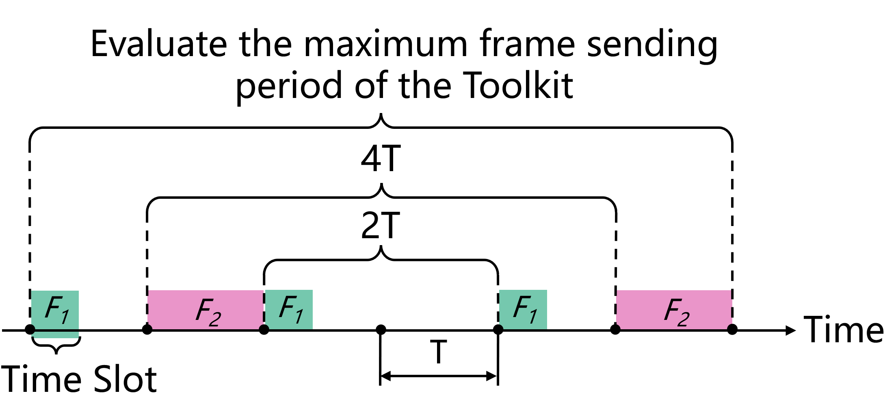

# 系统设计

ZIGGO 实现于 ZYNQ-7000 SoC 上，利用 ZYNQ 的硬件和软件可编程性。


## 目录

- [系统设计](#系统设计)
  - [目录](#目录)
  - [评估方法](#评估方法)
  - [测试数据帧数据结构](#测试数据帧数据结构)
  - [模块设计](#模块设计)
    - [软件和硬件寄存器的对应关系](#软件和硬件寄存器的对应关系)
    - [离线分析和设计](#离线分析和设计)

## 评估方法

ZIGGO 评估工具包用于发送和接收测试数据帧，以确保 `准确的延迟计算`。

为了实现这一准确性，工具包需要与 TSN 交换机 **同步时间** 并在测试数据帧中记录一个 **全局硬件时间戳**。

如下图所示，在具有  n  个网络节点的数据流链路中，节点  1  作为源节点发送测试数据帧，节点  n  作为目的节点接收测试数据帧，所有中间节点（节点  2  到节点  n-1 ）都是 TSN 交换机。

当测试数据帧从源节点发送时，硬件会记录帧发送时的时间戳  t^+  并将其写入数据帧中。最后，当数据帧到达目的节点时，目的节点记录帧进入该节点时的时间戳  t^- 。通过计算  t^--t^+ ，我们可以确定数据帧的端到端延迟。


> 在本文档中， t^{dir}  用于表示数据帧进入和离开硬件的时间戳。这里，"dir" 表示数据帧进入或离开节点的方向，"+" 表示数据帧离开节点，"−" 表示数据帧进入节点。

## 测试数据帧数据结构

为了分析复杂网络拓扑上每个数据帧的端到端延迟，我们对以太网帧结构中数据段的内容制定了具体的指南。时间敏感网络测试数据帧的结构如下表所示。

| 字段                    | 字节长度 | 描述                                                                                                    |
| ----------------------- | -------- | ------------------------------------------------------------------------------------------------------- |
| 目的地址                | 6        | 目的节点 MAC 地址                                                                                       |
| 源地址                  | 6        | 源节点 MAC 地址                                                                                         |
| VLAN 标签               | 4        | 分为四个字段：VLAN 数据帧类型（0x8100）、优先级、规范格式指示符和 VLAN 编号                              |
| 数据帧类型              | 2        | 用于识别测试数据帧，设置为 0x66ab                                                                        |
| 保留位                  | 2        |                                                                                                         |
|  t^+ （发送时间戳） | 8        | 从源节点发送时的时间戳                                                                                  |
|  t^- （接收时间戳） | 8        | 在目的节点接收时的时间戳                                                                                 |
| 数据流 ID（SEQ_ID）     | 2        | 每个数据流的唯一标识符                                                                                   |
| 数据帧 ID（PKT_ID）     | 4        | 每个数据流中数据帧的序列号，从 0 开始                                                                   |

## 模块设计

ZIGGO 评估工具包的整体模块设计如下图所示。工具包使用的时间同步模块与交换机的设计几乎相同，图中未详细描述时间同步相关模块。

PS 部分的配置模块（`software/pkt_gen_main.cpp`）通过使用 UIO 驱动程序和 AXI4-Lite 接口与数据帧生成模块通信，将测试数据帧的传输规则发送到数据帧生成模块（具体来说，`hardware/IP_repo/pkt_gen_controller_v1.1/pkt_gen_controller_1.1/hdl/pkt_gen_controller_v1_1.v` 负责配置，`hardwire/HDL/axi_packet_generator.v` 负责生成和传输数据帧）的相关寄存器中，并以全局同步时间为参考进行计时。

时间戳标记模块（`hardwire/HDL/hw_timestamp/tsu/tsu_axis_tx.v` 和 `hardwire/HDL/hw_timestamp/tsu/tsu_axis_rx.v`）位于 Ziggo 评估工具包的发送和接收端口，用于记录发送和接收数据帧的硬件时间戳。

接收到的数据帧最终通过 DMA 通道上传到 PS 部分进行统计分析（在 `software/pkt_gen_control/pkt_gen.c` 中的 `process_critical_frame` 函数中处理）。


最大帧传输周期（`pkt_gen_main.cpp` 中的 superperiod 参数）是指从工具包发送数据流的周期的上限。在这个最大帧传输周期内，数据帧生成模块为所有数据流分配最多 32 个时间槽。每个时间槽用于在指定的传输时间发送相应数据流的所有数据帧。

如图所示，评估工具包发送两种类型的数据流：传输周期为 2𝑇 的流 𝐹1 和传输周期为 4𝑇 的流 𝐹2。评估工具包的最大帧传输周期为 6𝑇。在这种情况下，数据帧生成模块在最大帧传输周期内设置了 5 个时间槽，并根据指定的时间槽顺序发送测试数据帧。



用户可以配置 Ziggo 评估工具包生成多个数据流，每个数据流的配置参数如下，在 `pkt_gen.h` 头文件的注释中提供了清晰的解释：

```C++
// pkt_gen_app\pkt_gen_control\pkt_gen.h

/**
 * @brief 设置 pkt 生成槽对象
 * 
 * @param slot_id 0~31，表示 pkt_gen IP 核中的一个槽
 *      重要提示：每个 slot id 的 tx_offset 应该是单调递增的
 * @param seq_id 唯一标识数据流的序列 ID
 *              为了进一步利用此字段，它可能是 {job_id: 8bit, flow_id: 8bit}
 * @param pkt_number 一次发送的数据包数量，应该是 1
 * @param pkt_id_start pkt_id 的起始值
 * @param pkt_id_update 下一个 pkt_id 的更新值
 * @param tx_offset 周期内的传输时间，以 ns 为单位
 * @param src_mac 6 字节数组
 * @param dest_mac 6 字节数组
 * @return int 
 */
int set_pkt_gen_slot (int slot_id, uint16_t seq_id, uint16_t pkt_number, uint32_t pkt_id_start, 
        uint32_t pkt_id_update, int64_t tx_offset, uint8_t *src_mac, uint8_t *dest_mac);
```

时间戳标记模块将在 MAC 控制器传输数据帧之前将当前同步时钟的时间戳写入传出的数据帧。当 PL（可编程逻辑）中的 MAC 控制器从物理链路接收帧中的第一个数据位时，时间戳标记模块会记录当前同步时钟的时间戳。随后在数据包接收过程中将此时间戳写入数据帧，并交给 PS（处理系统）部分的统计分析模块进行进一步分析和处理。

### 软件和硬件寄存器的对应关系

时间同步方面的对应关系与 Ziggo TSN 交换机相同。

在本节中，我们将主要关注与数据帧传输配置相关的对应关系。软件寄存器的

地址可以在 `software/pkt_gen_control/pkt_gen.c` 中找到。

```C++
// 定义全局寄存器地址
#define GLOBAL_PERIOD_NS    0x00000000
#define GLOBAL_OFFSET_NS    0x00000008
#define SEQ_VALID           0x00000010
#define SEQ_ENABLE_VLAN     0x00000014
#define WRITE_LOCK          0x00000018

// 定义写入锁定值
#define NOT_WRITING     0x00000001
#define WRITING         0x00000000

// 定义序列的地址指针
#define SEQ_CONTENT     0x0000001c
```

硬件寄存器位于 `tsn_device\IP_repo\pkt_gen_controller_v1.1\pkt_gen_controller_1.1\hdl\pkt_gen_controller_v1_1_S00_AXI.v`。

```c++
if (slv_reg_wren)
      begin
        case ( axi_awaddr[ADDR_LSB+OPT_MEM_ADDR_BITS:ADDR_LSB] )
          9'h000:
            for ( byte_index = 0; byte_index <= (C_S_AXI_DATA_WIDTH/8)-1; byte_index = byte_index+1 )
              if ( S_AXI_WSTRB[byte_index] == 1 ) begin
                // 根据写入选通信号启用相应的字节
                // 从寄存器 0
                slv_reg0[(byte_index*8) +: 8] <= S_AXI_WDATA[(byte_index*8) +: 8];
              end  
          9'h001:
            for ( byte_index = 0; byte_index <= (C_S_AXI_DATA_WIDTH/8)-1; byte_index = byte_index+1 )
              if ( S_AXI_WSTRB[byte_index] == 1 ) begin
                // 根据写入选通信号启用相应的字节
                // 从寄存器 1
                slv_reg1[(byte_index*8) +: 8] <= S_AXI_WDATA[(byte_index*8) +: 8];
              end  
          9'h002:
            for ( byte_index = 0; byte_index <= (C_S_AXI_DATA_WIDTH/8)-1; byte_index = byte_index+1 )
              if ( S_AXI_WSTRB[byte_index] == 1 ) begin
                // 根据写入选通信号启用相应的字节
                // 从寄存器 2
                slv_reg2[(byte_index*8) +: 8] <= S_AXI_WDATA[(byte_index*8) +: 8];
              end  
...
```

在这种情况下，以 "slv_reg" 开头的硬件寄存器每个都是 32 位宽，并且它们的地址间隔为 4 字节。因此，例如，如果软件级地址是  0x00000018 ，您需要将此地址除以 4，结果是  24/4 = 6 。因此，此地址对应于硬件模块中的硬件寄存器 "`slv_reg6`"。这有助于建立软件和硬件寄存器之间的对应关系。

### 离线分析和设计

在工具包的 `offline_analyze` 分支中，我们通过将数据包从工具包转发到功能强大的台式计算机进行数据包捕获和分析。这种方法确保即使在千兆位速率下也不会丢包，并且硬件更改相对较少。

一种修改是，在从工具包传输数据帧时不会在数据帧中添加时间戳。这可以在 `HDL/trimode_mac/simple_mac_no_shared.v` 文件中看到，其中 "tsu_axis_tx" 部分被注释掉。

另一种修改是更改 "frame_type" 以改变数据帧的方向。以前，PTP 帧和测试数据帧都通过时间同步 DMA 上传到 PS 部分，IT 流量上传到 PS_ETH。这将流量分为两个方向（"axis_switch_1_2"）。现在，它被分为三个方向（"axis_switch_1_3"）。对于离线分析，只需要将 PTP 帧传输到 PS，而测试数据帧需要分离并从 ETH2 发送出去。这需要对流量进行更精细的分离。

```c++
// 分离 IT 帧、PTP 帧和关键帧
axis_switch_1_3 axis_switch_1_3_inst (
    .aclk(rx_fifo_clock),                    // 输入时钟
    .aresetn(rx_fifo_resetn),              // 输入复位信号
    .s_axis_tvalid(rx_axis_fifo_tvalid_8),  // 输入数据有效信号
    .s_axis_tready(rx_axis_fifo_tready_8),  // 输出数据准备信号
    .s_axis_tdata(rx_axis_fifo_tdata_8),    // 输入数据
    .s_axis_tlast(rx_axis_fifo_tlast_8),    // 输入数据结束信号
    .s_axis_tdest(frame_type),    // 输入数据目的地址
    .m_axis_tvalid({rx_axis_it_fifo_tvalid, rx_axis_ptp_fifo_tvalid, tx_axis_fifo_legacy_tvalid[1]}),  // 输出数据有效信号
    .m_axis_tready({rx_axis_it_fifo_tready, rx_axis_ptp_fifo_tready, tx_axis_fifo_legacy_tready[1]}),  // 输入数据准备信号
    .m_axis_tdata({rx_axis_it_fifo_tdata, rx_axis_ptp_fifo_tdata, tx_axis_fifo_legacy_tdata[1]}),    // 输出数据
    .m_axis_tlast({rx_axis_it_fifo_tlast, rx_axis_ptp_fifo_tlast, tx_axis_fifo_legacy_tlast[1]}),    // 输出数据结束信号
    .m_axis_tdest(),    // 输出数据目的地址
    .s_decode_err()    // 输出解码错误信号
);
```

`tx_axis_fifo_legacy_tdata[1]` 表示从 ETH2 发送。