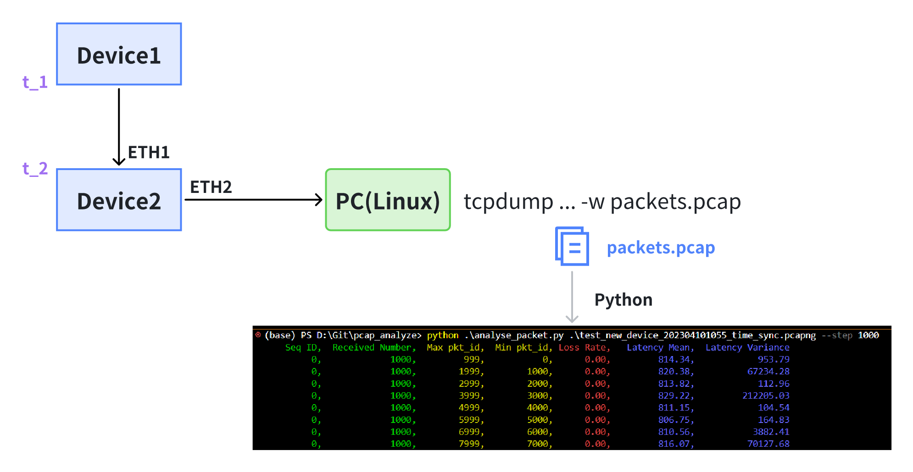

# ZIGGO Device使用手册

ZIGGO Device有两种分析方法：

> 提示：如果您想使用离线分析，请切换到 'offline_analyze' 分支，并且需要通过网线将设备连接到另一台运行Linux的PC。

一种方法是 `直接` 在 ZIGGO Device 上分析延迟和抖动。这种方法的优点是方便快捷。我们可以直接在设备上统计所有接收到的数据帧的延迟和抖动。然而，由于开发板 CPU 的处理能力有限，当分析大量数据包（例如每次发送超过10个1500B数据包，周期为33ms）时，可能会出现丢包现象。


另一种方法是使用设备对接收的数据包进行时间戳标记，并通过另一个端口转发到功能强大的台式计算机进行数据包捕获分析。即使以千兆位速率进入设备，也不会丢包。缺点是需要离线编写单独的程序来分析数据包的延迟和抖动。



## ZIGGO Device直接分析延迟和抖动

在 `time sync` 程序运行期间，接收到测试数据帧后，程序会将数据帧的延迟信息保存在 `build/packet_log.csv` 文件中，同时将延迟和抖动的批量统计信息保存在 `build/critical_log.csv` 文件中。

`packet_log.csv` 示例：

```
Seq ID, Pkt ID, TX timestamp, RX timestamp, Latency
0101, 0, 12683587446, 12683613722, 26276
0101, 1, 12683599662, 12683625970, 26308
0101, 2, 12683611862, 12683638162, 26300
0101, 3, 12683624078, 12683650386, 26308
0101, 4, 12717142039, 12717168273, 26234
0101, 5, 12717154223, 12717180465, 26242
0101, 6, 12717166391, 12717192625, 26234
0101, 7, 12717178575, 12717204825, 26250
0101, 8, 12750696471, 12750722712, 26241
0101, 9, 12750708655, 12750734904, 26249
```

`critical_log.csv` 示例，其中延迟方差是延迟的方差：

```
Seq ID, Received Number, Max pkt_id, Min pkt_id, Loss Rate, Latency Mean, Latency Variance
0101, 1000, 0, 999, 0.000000,  26230, 1199
0101, 1000, 1000, 1999, 0.000000,  26218, 2811
0101, 1000, 2000, 2999, 0.000000,  26218, 2808
0101, 1000, 3000, 3999, 0.000000,  26195, 18331
0101, 1000, 4000, 4999, 0.000000,  26233, 921
0101, 1000, 5000, 5999, 0.000000,  26226, 852
0101, 1000, 6000, 6999, 0.000000,  26226, 5080
0101, 1000, 7000, 7999, 0.000000,  26250, 105272
0101, 1000, 8000, 8999, 0.000000,  26204, 7233
0101, 1000, 9000, 9999, 0.000000,  26205, 7361
```

您可以使用以下命令显示标题和最后5行的内容：

```bash
cat critical.log | head -n1
cat critical.log | tail -n5
```

## 离线分析延迟和抖动

如果进行离线分析，需要注意使用的硬件位于 `offline_analyze` 分支。此版本会将关键数据标记为接收时间戳，并从 ETH2 转发。我们需要使用一台装有 Linux 系统的 PC 来捕获数据包进行分析。

数据包捕获命令示例：

```bash
sudo tcpdump -i enx207bd272812b ether src 00:0a:35:00:00:14 -n -B 100000 -w packets.pcapng
```

`Enx207bd272812b` 是网卡名称，可以通过 ifconfig 获取。`Src` 用于指定捕获的数据包来自某个 MAC 地址。`-B` 用于指定缓冲区大小。如果需要设置更大的缓冲区大小以避免丢包，可以查看数据包捕获后的输出信息，查看 Dropped by kernel 是否为 0。如果不是 0，则表示内核中存在丢包。`-W` 指定文件的保存路径。

用于分析程序的代码是 `analyze_packet.py`

```bash
python ./analyze_packet.py [capture file path] --step [interval]
```

同时，将在当前目录生成一个数据包（`packet_log.csv` 和 `critical_log.csv`）。