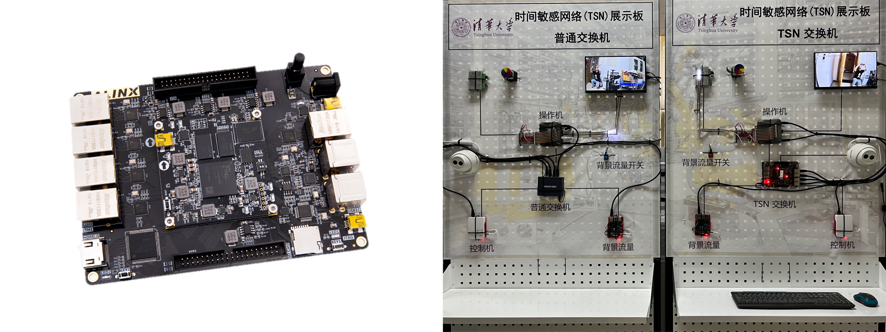
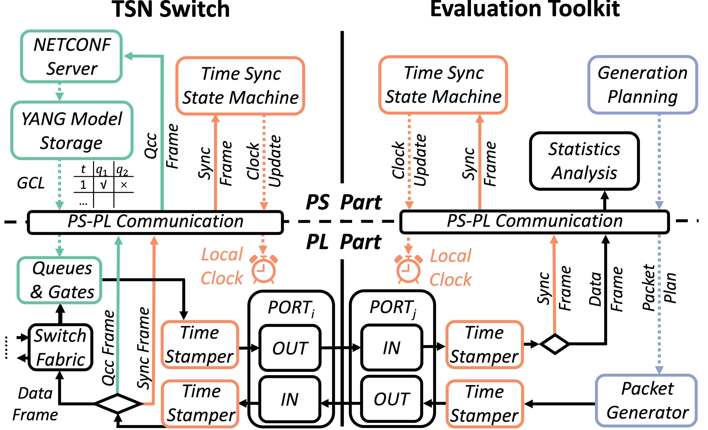

<div align="center">

# ZIGGO CaaS Switch: 一种灵活、符合标准且控制功能虚拟化的TSN交换机平台

</div>

<h3 align="center">
    <a href="https://mobisense.github.io/ziggo_homepage/">项目页面</a> |
    <a href="https://ieeexplore.ieee.org/document/10228980">论文</a> |
    <a href="https://github.com/MobiSense/Ziggo-TSNPerf">ZIGGO-TSNPerf</a> |
    <a href="https://github.com/Mobisense/Ziggo-CaaS-Switch">ZIGGO-Switch</a> |
    <a href="https://github.com/MobiSense/Ziggo-Device">ZIGGO-Device</a>
</h3>


## 目录

- [ZIGGO CaaS Switch: 一种灵活、符合标准且控制功能虚拟化的TSN交换机平台](#ziggo-caas-switch-一种灵活符合标准且控制功能虚拟化的tsn交换机平台)
  - [目录](#目录)
  - [简介](#简介)
  - [ZIGGO 开放平台](#ziggo-开放平台)
  - [演示](#演示)
  - [功能](#功能)
  - [开始前阅读](#开始前阅读)
  - [快速入门](#快速入门)
  - [系统设计](#系统设计)
  - [演示应用教程](#演示应用教程)
  - [许可和引用](#许可和引用)
  - [待办事项](#待办事项)
  - [贡献](#贡献)

## 简介

ZIGGO 是一个 `灵活`、`符合标准` 且 `控制功能虚拟化` 的 TSN 交换机平台，适用于**工业控制**、**汽车电子**及其他**时间敏感应用**。

这是 ZIGGO CaaS Switch 的文档。（我们还提供符合 IEEE 802.1 TSN 标准的 [ZIGGO-Device](https://github.com/Mobisense/Ziggo-Device)。）

## ZIGGO 开放平台


ZIGGO 开放平台的构建包括三个层次：网络设备、管理工具和演示应用。更多详细信息请见 [ZIGGO-Device](https://github.com/Mobisense/Ziggo-Device)。

## 演示

我们提供了 TSN 交换机的演示视频。视频展示了 `ZIGGO-CaaS-Switch` 相较于普通交换机的优越性能。

图片左侧是我们使用的 ZYNQ 开发板，右侧是我们构建的 TSN 显示板。

[](https://cloud.tsinghua.edu.cn/f/b307da6840d84e5f9ff1/)

> 点击图片观看视频！或者点击[这里](https://cloud.tsinghua.edu.cn/f/b307da6840d84e5f9ff1/)。

## 功能

* ZIGGO 支持同时传输 `信息技术（IT）` 和 `操作技术（OT）` 数据流量，并提供 QoS 保证。

* ZIGGO 符合 IEEE 标准 `802.1AS`、`Qav`、`Qbv` 和 `Qcc`。

* ZIGGO 提供 `实时` 和 `确定性` 以太网传输
  
  * ZIGGO 实现 **零丢包**、**微秒级延迟** 和 **纳秒级抖动门控能力**。
  
  * ZIGGO 保证 **千兆吞吐量**。
  
  * ZIGGO 提供适用于 **所有以太网帧大小** 的门控精度。

## 开始前阅读

开始使用 ZIGGO-CaaS-Switch/ZIGGO-Device 是一个***相当困难***的任务。用户/开发者需要具备足够的基础知识，并准备好进行长时间的学习和调试。

请参考 [basic_knowledge.md](/ziggo_book/zh/docs/switch/basic_knowledge/) 以检查您是否有能力胜任 ZIGGO。

## 快速入门

请参考 [required.md](/ziggo_book/zh/docs/switch/require/) 进行准备。

请参考 [hardware-build.md](/ziggo_book/zh/docs/switch/hardware-build/) 构建 ZIGGO 评估工具包的硬件，并参考 [software-build.md](/ziggo_book/zh/docs/switch/software-build/) 运行时间同步逻辑并设置 TSN GCL。

## 系统设计

ZIGGO 实现于 ZYNQ-7000 SoC 上，利用 ZYNQ 的硬件和软件可编程性。



我们还提供了更深入的[文档](/ziggo_book/zh/docs/switch/system-design/)，解释 ZIGGO CaaS Switch 的具体设计原则。

## 演示应用教程

我们还提供了一个 [测试平台构建文档](/ziggo_book/zh/docs/device/testbed/)(在 ZIGGO Device 中)，允许您使用 ZIGGO 交换机和 ZIGGO 设备构建实时以太网系统。

通过该平台，我们可以测量 TSN 时间关键流量的 `延迟` 和 `抖动`、交换机的 `门控能力`、`带宽保证` 和 `门控精度`。

用商业 TSN 交换机替换 ZIGGO CaaS 交换机也可以测试其上述能力。

## 许可和引用

ZIGGO 根据 [MIT 许可](https://github.com/MobiSense/Ziggo-CaaS-Switch/blob/main/LICENSE.txt) 发布。

如果该项目对您的研究有帮助，请考虑引用我们的论文，BibTex 如下：

```bibtex
@inproceedings{caas,
  author={Yang, Zheng and Zhao, Yi and Dang, Fan and He, Xiaowu and Wu, Jiahang and Cao, Hao and Wang, Zeyu and Liu, Yunhao},
  booktitle={IEEE INFOCOM 2023 - IEEE Conference on Computer Communications},
  title={CaaS: Enabling Control-as-a-Service for Time-Sensitive Networking},
  year={2023},
  pages={1-10},
  doi={10.1109/INFOCOM53939.2023.10228980}
}
```

```bibtex
@inproceedings{etsn,
  author={Zhao, Yi and Yang, Zheng and He, Xiaowu and Wu, Jiahang and Cao, Hao and Dong, Liang and Dang, Fan and Liu, Yunhao},
  booktitle={IEEE ICDCS 2022 - IEEE International Conference on Distributed Computing Systems}, 
  title={E-TSN: Enabling Event-triggered Critical Traffic in Time-Sensitive Networking for Industrial Applications}, 
  year={2022},
  volume={},
  number={},
  pages={691-701},
  doi={10.1109/ICDCS54860.2022.00072}}
```

## 待办事项

- [x] ZIGGO CaaS Switch 发布

- [x] ZIGGO 评估工具包发布

- [x] ZIGGO 评估工具包源代码

- [x] 搭建测试平台教程

- [ ] TSN 测试用例

> 我们将在教程中扩展每个测试到多个测试用例，以涵盖不同的边缘情况并全面测试 TSN 交换机的性能。

- [ ] 支持设备列表

> 目前，我们仅测试了自己的 Ziggo 交换机，并正在测试其他商业交换机（如华为、H3C 和 NXP）。我们预计将来维护一个测试结果列表。

## 贡献

请参阅[指南](/ziggo_book/zh/docs/switch/contributing/)，了解如何寻求帮助或为 ZIGGO 的开发做出贡献！

> 开发团队只会回答 GitHub 问题上的问题，拒绝其他形式的提问。