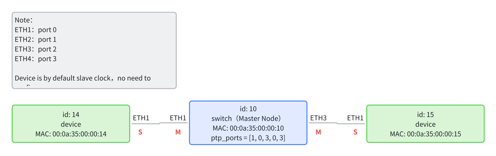

# 软件构建
此仓库包含启用 CaaS 交换机时间同步逻辑和设置 TSN GCL（门控列表）、交换机转发规则（包括到双 DMA）的源代码。

## 构建

```bash
mkdir build
cd build
cmake ..
make
```

成功构建后，将有两个可执行文件："time_sync_app" 和 "switch_config"。

## 配置

"config" 目录包含拓扑和 TSN/CaaS 调度结果。

本文档以以下拓扑为例给出示例配置：



* ***-config.json: 主要描述网络的拓扑结构，包括每个节点的类型（设备或交换机）、MAC 地址、PTP 端口状态和其他节点信息、拓扑信息和 MAC 转发表。示例如下（注意文件中的注释仅用于说明，实际使用中不应包含这些注释）：
  
  ```json
  {
      "nodes": [ // 用于描述网络中每个节点的信息
          {
              "id": 10, // 节点 ID，对应下文的 "src" 和 "dst"
              "type": "switch", // 节点类型，分为 "switch" 和 "device"
              "mac": "00:0a:35:00:00:10", // 节点的物理 MAC 地址
              "ptp_ports": [
                  1,
                  0,
                  3,
                  0,
                  3
              ] // 节点的 PTP 端口状态
              // 五元组表示 [local, ETH1, ETH2, ETH3, ETH4] 的时钟状态
              // 数字含义：（0：MASTER，1：SLAVE，2：PASSIVE，3：DISABLED）
              // 如果 local 为 1，则表示该节点是主时钟节点；
              // 如果 local 为 0，则表示该节点是从时钟节点。
          },
          {
              "id": 14,
              "type": "device",
              "mac": "00:0a:35:00:00:14"
          },
          {
              "id": 15,
              "type": "device",
              "mac": "00:0a:35:00:00:15"
          }
      ],
      "links": [  // 拓扑信息，由每个链路组成，每个链路是一个有向边
          {
              "id": 0, // 链路 ID
              "src": 14, // 链路的源节点 ID
              "src_port": 0, // 源节点的端口号
                             // 端口 0,1,2,3 分别对应实际的 ETH1,2,3,4
              "dst": 10, // 链路的目标节点 ID
              "dst_port": 0 // 目标节点的端口号
          },
          {
              "id": 1,
              "src": 10,
              "src_port": 0,
              "dst": 14,
              "dst_port": 0
          },
          {
              "id": 2,
              "src": 10,
              "src_port": 2,
              "dst": 15,
              "dst_port": 0
          },
          {
              "id": 3,
              "src": 15,
              "src_port": 0,
              "dst": 10,
              "dst_port": 2
          }
      ],
      "fwd": [ // 转发表，可以由 CNC 中的调度算法生成
          // 在转发表中将自己发送给自己的规则中，端口为 4（caas）/ 5（适用于新硬件的 PS ETH）
          {
              "src": 10, // 当前节点 ID
              "dst": 14, // 输出端口号
              "id": 0, // 表项 ID
              "src_port": 0 // 目标节点 ID
          },
          {
              "src": 14,
              "dst": 10,
              "id": 1,
              "src_port": 0
          },
          {
              "src": 10,
              "dst": 15,
              "id": 2,
              "src_port": 2
          },
          {
              "src": 15,
              "dst": 10,
              "id": 3,
              "src_port": 0
          }
      ]
  }
  ```
  
  如果使用主时钟选择算法，则仅节点配置不同，其余相同。新增的 `externalPortConfigurationEnabled` 和 `system_identity` 字段为可选项，如下示例：
  
  ```json
  {
      "nodes": [
          {
              "type": "switch",
              "id": 0,
              "mac": "00:00:00:00:02:01",
              "ptp_ports": [0,0,0,0,0], 
              "externalPortConfigurationEnabled": 1, // 1：手动配置主从关系，0：通过主时钟选择算法配置主从关系，如果未写此项，默认值为 0，即通过主时钟选择配置主从关系
              "system_identity": { // 时钟节点的时钟参数，用于主时钟选择算法中的比较，如果未写此项，默认配置如下
                  "priority1": 254, // 第一优先级
                  "clockClass": 248, // 时钟级别
                  "clockAccuracy": 254, // 时钟精度
                  "offsetScaledLogVariance": 17258, // 时钟方差
                  "priority2": 247, // 第二优先级
                  "clock_identity": [0,0,0,0,0,0,0,0] // 时钟标识符，不同的时钟应具有不同的参数
              }
          }
      ],
      "links": [
      ],
      "fwd": [
      ]
  }
  ```

* ***-schedule.json: 调度文件，包含每条链路的调度时间间隔和每个 CaaS 交换机的计算时间间隔。
  
  ```json
  [
      {// 需要列出所有交换机，以便软件识别配置信息
          "type": "switch",  // 节点类型，分为 "switch" 和 "device"
          "id": 10, // 节点 ID，对应下文的 "src" 和 "dst"
          "mac": "00:0a:35:00:00:10", // 节点的物理 MAC 地址
          "schedule": [
          ] // 可以为空，不使用
      },
      {
          "type": "link", // 类型为 link，用于描述调度信息
          "from": 14, // 链路的源节点 ID
          "to": 10, // 链路的目标节点 ID
          "from_port": 0, // 输出端口号
          "id": 3, 
          "schedule": [ // 调度信息
              {
                  "period": 2048, // 调度周期
                  "start": 0, // 相对于整个周期的开始时间
                  "end": 5, // 相对于整个周期的结束时间
                  "job_id": 0, // CaaS 中的作业 ID，如果不需要，可以省略
                  "flow_id": 0 // 数据流 ID
              }
          ]
      },
      {
          "type": "link",
          "from": 10,
          "to": 15,
          "from_port": 2,
          "id": 0,
          "schedule": [
              {
                  "period": 2048,
                  "start": 1,
                  "end": 6,
                  "job_id": 0,
                  "flow_id": 0,
                  "pkt_size": 1500 // 数据包长度，如果未写，默认值为 1500B，此项仅存在于从设备到交换机的路径上
              }
          ]
      }
  ]
  ```

## 运行

* 将拓扑和调度文件复制到构建目录：

```bash
cp [拓扑名称]-config.json build/config.json
cp [拓扑名称]-schedule.json build/schedule.json
```

* 根据配置启动时间同步并初始化 GCL 和 MAC 转发表（建议将时间同步程序运行在一个核心上（使用 `taskset -c 1` 命令），以防止由于时间同步导致的内核错误和崩溃）：

```bash
taskset -c 1 ./time_sync
```

* 日志输出级别分为 WARN、INFO 和 TRACE 三种类型。默认日志输出级别为 TRACE（最全面的输出信息，包括 DEBUG 日志）。可以使用 -l 参数设置日志输出级别：

```bash
taskset -c 1 ./time_sync -l w #

 WARN 级别
taskset -c 1 ./time_sync -l i # INFO 级别
taskset -c 1 ./time_sync -l t # TRACE 级别
```

*注意：时间同步逻辑应无限期运行，因为节点应该不断与其邻居同步。*

* 更新 GCL 和交换机转发规则：

```bash
./switch_config
```