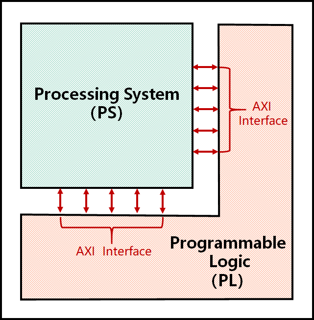

# 系统设计
CaaS/TSN 交换机基于 ZYNQ 平台开发。下图显示了 ZYNQ 芯片的组成。ZYNQ 主要由处理系统（PS）和可编程逻辑（PL）组成。PS 和 PL 主要通过高性能高级可扩展接口（AXI）相互通信，这比直接使用 FPGA 作为外围设备更有效。PS 包含一个适合运行应用程序、驱动程序和操作系统的基于 ARM 的处理器，而 PL 包含适合运行具有高实时性能要求的低级硬件逻辑的 FPGA。



对于交换机，PL 部分主要实现：

1. 时间同步中的实时时钟模块和时间戳缓存模块；
2. 交换机的基本转发功能和流量控制功能。

PS 部分主要实现：

1. 与时间同步相关的状态机逻辑；
2. 交换机的配置程序。

## 时间同步

请参考维基百科了解关于[时钟同步](https://en.wikipedia.org/wiki/Clock_synchronization)的基本知识。

TSN 交换机符合 IEEE 802.1AS 标准。它以去中心化的方式同步邻居时钟，实现亚微秒级的时钟精度，适用于测量和控制系统。对于每对连接的设备，其时间同步状态机将测量链路延迟并根据主时钟更新本地 RTC（实时时钟）。

时间同步模块的总体设计如下图所示。PS 主要由时间同步状态机模块组成，主要运行 802.1AS 标准中定义的状态机逻辑。PL 主要由实时时钟模块和时间戳缓存模块组成，主要负责运行实时时钟并记录数据帧进入和退出交换机端口时的时间。


当数据帧从交换机的输入端口进入 PL 时，时间戳缓存模块将记录并缓存数据帧进入硬件时的时间戳。交换机的交换模块将确定数据帧是否与时间同步相关。时间同步数据帧将通过直接内存访问（DMA）通道从 PL 转发到 PS 进行处理。在 PS 中，时间同步状态机模块需要通过 AXI4-Lite 接口获取底层 PL 的实时时钟信息和与不同数据帧对应的硬件时间戳。当交换机需要发送与时间同步相关的数据帧时，PS 负责封装发送的数据帧，然后通过 DMA 通道转发到 PL 进行处理。由于时间同步还需要记录 Sync 和 Pdelay_Req 等消息的发送时间，时间戳缓存模块将在数据帧从输出端口发送之前缓存发送时间戳，以便 PS 稍后使用。

## 交换结构与门控

交换结构与门控模块的总体设计如下图所示。PS 部分主要包括一个配置模块，用于软件级别配置交换机的门控列表（GCL）和 MAC 转发表；PL 部分主要由交换结构和门控模块组成，负责端口转发和流量的实时控制。


当数据帧从输入端口进入 PL 时，普通流量和关键流量都会进入交换结构。交换结构将根据数据帧中的目标 MAC 地址查找相应的输出端口，然后将数据帧放入门控模块中的优先级队列中。门控模块将根据预先配置的 GCL 控制每个优先级队列的门状态，然后从相应的端口转发数据帧。在上述过程中，门控模块需要从时间同步模块获取全局同步时间。PS 部分的配置模块主要通过 UIO 驱动程序和 AXI4-Lite 接口修改与 GCL（`tsn_drivers\gcl.c`）和 MAC 转发表（`tsn_drivers\switch_rules.c`）相关的寄存器，从而控制 PL 部分交换结构和门控模块中的参数。

## 源代码描述

### 时间同步状态机

时间同步的主要功能位于 `time_sync_main_loop.c` 中。它基于 IEEE 802.1AS 2020 标准实现。下表介绍了代码中状态机代码与标准中状态机的对应关系。

| 代码文件名 (.c/.h)                  | 对应的 802.1AS-2020 章节 |
| ----------------------------------- | ----------------------- |
| site_sync_sync_sm                   | 10.2.7 SiteSyncSync     |
| port_sync_sync_receive_sm           | 10.2.8 PortSyncSyncReceive |
| clock_master_sync_send_sm           | 10.2.9 ClockMasterSyncSend |
| clock_master_sync_receive_sm        | 10.2.11 ClockMasterSyncReceive |
| port_sync_sync_send_sm              | 10.2.12 PortSyncSyncSend |
| clock_slave_sync_sm                 | 10.2.13 ClockSlaveSync  |
| port_announce_information_sm        | 10.3.12 PortAnnounceInformation |
| port_state_selection_sm             | 10.3.13 PortStateSelection |
| port_announce_information_ext_sm    | 10.3.14 PortAnnounceInformationExt |
| port_announce_transmit_sm           | 10.3.16 PortAnnounceTransmit |
| md_sync_receive_sm                  | 11.2.14 MDSyncReceiveSM |
| md_sync_send_sm                     | 11.2.15 MDSyncSendSM    |
| md_pdelay_req_sm                    | 11.2.19 MDPdelayReq     |
| md_pdelay_resp_sm                   | 11.2.20 MDPdelayResp    |

### UIO 地址

UIO 驱动程序主要用于将逻辑地址映射到物理地址，从而控制 TSU、RTC、GCL 等模块的寄存器。驱动程序代码位于 `tsn_drivers` 文件夹中。软件部分和硬件寄存器地址之间的对应关系在头文件中描述。

例如，在 `tsn_drivers\rtc.h` 文件中，RTC 模块的地址定义如下：

```c++
// 定义 RTC 地址值
#define RTC_CTRL       0x00000000
#define RTC_NULL_0x04  0x00000004
#define RTC_NULL_0x08  0x00000008
#define RTC_NULL_0x0C  0x0000000C
#define RTC_TIME_SEC_H 0x00000010
#define RTC_TIME_SEC_L 0x00000014
#define RTC_TIME_NSC_H 0x00000018
#define RTC_TIME_NSC_L 0x0000001C
#define RTC_PERIOD_H   0x00000020
#define RTC_PERIOD_L   0x00000024
#define RTC_ADJPER_H   0x00000028
#define RTC_ADJPER_L   0x0000002C
#define RTC_ADJNUM     0x00000030
#define RTC_OFFSET_S_H 0x00000034
#define RTC_OFFSET_S_L 0x00000038
#define RTC_OFFSET_NS  0x0000003C
```

### MAC 转发

`switch_rules.c/h` 文件中配置的 MAC 地址转发表实际上操作了交换机数据路径和门控列表中的寄存器。这些寄存器成对存在，第一个寄存器表示目标 MAC 地址最后 32 位的网络字节顺序，第二个寄存器表示转发端口。

CaaS 交换机有 7 个端口，其中 4 个是外部物理端口，3 个是连接 PL 和 PS 的交换机内部虚拟端口。这 3 个内部虚拟端口具体包括：

- 时间同步 DMA：用于在 PS 和 PL 之间传输时间同步数据帧。
- PS ETH：用于 PL 的物理网络端口与 PS 的操作系统之间的通信（例如，使用 SSH 客户端远程登录并访问交换机的 PS）。
- PLC DMA：用于 CaaS 中传输控制任务的输入和输出。

以下接口用于控制交换结构的转发规则：

```c++
int push_switch_rule(char *mac_addr, int output_port) {
    /* 
        将交换规则推送到规则表
        mac_addr: 6 字节目标 MAC 地址。
        output_port: 0 -> 到端口 0
                    1 -> 到端口 1
                    2 -> 到端口 2
                    3 -> 到端口 3
                    4 -> 到 PLC DMA
        PTP 帧的交换规则在硬件中是固定的，无需显式指定。
    */
   ...
}
```

### 门控

TSN 关键流量数据帧采用标准 VLAN 数据帧格式，优先级在 VLAN 标记中定义。VLAN 是指虚拟局域网技术，定义在 802.1Q 标准中。如下图所示，标准

 VLAN 数据帧包含一个 4 字节的 VLAN 标记，TPID 字段表示 VLAN 数据帧类型（`0x8100`），关键流量的优先级定义在 PRI 字段中，值范围为 [0, 7]，对应 8 个优先级队列。输出队列模块根据关键数据帧中的 VLAN 字段识别数据帧的优先级，然后将数据帧放入相应输出端口的优先级队列中等待传输。

*注意：根据 IEEE 802.1Qbv 标准，优先级 = 1 映射到优先级 0；优先级 = 0 映射到优先级 1；其他优先级映射到相应的队列。因此，普通流量默认进入相应端口的优先级队列 1。*

CaaS 交换机的门控模块实现了 802.1Qbv 定义的时间感知整形器，用于根据 PS 配置的 TSN 调度表执行硬件门控调度，以确保关键流量的确定性传输。
我们的 GCL 由 9 位表示，最高位表示是否启用保护带，其余 8 位表示门控开关。例如，`9'1_0000_0001` 表示启用保护带，并且只有第一个队列的门控开关是打开的。

*注意，硬件中 GCL 的时间单位为 2^11 ns，而配置文件中发出的时间单位为 2^14 ns。*

`gcl.c/h` 中提供以下接口，用于获取/设置硬件 GCL（分别设置门控状态和时间间隔）：

```c++
/**
 * @description: 此函数用于获取端口 [portNumber] 的 GCL 值。
 * @param {uint16_t} portNumber 端口号。
 * @return {*} 默认返回 0。
 */
int get_gcl(uint16_t portNumber) {
  ...
}
```

```c++
/**
 * @description: 此函数用于设置 GCL 值，将端口 [portNumber] 的 GCL[gcl_id] 设置为 [value]。
 * @param {uint16_t} portNumber 端口号，从 0 开始。
 * @param {uint16_t} gcl_id GCL 索引。
 * @param {uint16_t} value 要设置的 GCL 值。
 * @return {*} 默认返回 0。
 */
int set_gcl(uint16_t portNumber, uint16_t gcl_id, uint16_t value) {
    ...
}
```

```c++
/**
 * @description: 此函数用于获取端口 [portNumber] 的所有 GCL 时间间隔。考虑到我们获取的时间间隔为 x，实际时间间隔为 (x * 2^8 * 8) 纳秒。
 * @param {uint16_t} portNumber 端口号，从 0 开始。
 * @return {*} 默认返回 0。
 */
int get_gcl_time_interval(uint16_t portNumber)
{
    ...
}
```

```c++
/**
 * @description: 此函数用于设置 GCL 的时间间隔，将端口 [portNumber] 的 GCL 时间间隔[gcl_id] 设置为 [value]。
 * @param {uint16_t} portNumber 端口号，从 0 开始。
 * @param {uint16_t} gcl_id GCL 索引。
 * @param {uint16_t} value 要设置的 GCL 时间间隔 x。实际时间间隔为 (x * 2^8 * 8) 纳秒。
 * @return {*} 默认返回 0。
 */
int set_gcl_time_interval(uint16_t portNumber, uint16_t gcl_id, uint16_t value)
{
    ...
}
```