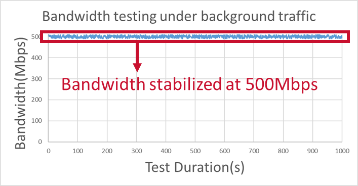

<div align="center">

# ZIGGO TSNPerf: 一个灵活、全面且用户友好的 TSN 评估工具包

</div>

<h3 align="center">
    <a href="http://tns.thss.tsinghua.edu.cn/ziggo/">项目页面</a> |
    <a href="https://ieeexplore.ieee.org/document/10228980">论文</a> |
    <a href="https://github.com/mobisense/Ziggo-CaaS-Switch">ZIGGO-CaaS-Switch</a> |
    <a href="https://github.com/mobisense/Ziggo-Evaluation-Toolkit">ZIGGO-Device</a>
</h3>


## 目录

- [ZIGGO TSNPerf: 一个灵活、全面且用户友好的 TSN 评估工具包](#ziggo-tsnperf-一个灵活全面且用户友好的-tsn-评估工具包)
  - [目录](#目录)
  - [简介](#简介)
  - [特点](#特点)
  - [入门](#入门)
  - [测试案例](#测试案例)
  - [许可证和引用](#许可证和引用)
  - [贡献](#贡献)
  - [致谢](#致谢)

## 简介

ZIGGO 是一个`灵活`、`符合标准`和`控制功能虚拟化`的 TSN 交换机平台，适用于**工业控制**、**汽车电子**和其他**时间敏感的应用**。

这是 ZIGGO TSNPerf 的文档。ZIGGO TSNPerf 是一个灵活、全面且用户友好的 TSN 评估工具包。它提供协议合规性评估和网络性能评估。下图说明了 ZIGGO TSNPerf 和 iPerf3 之间的相似性和差异。


## 特点

ZIGGO TSNPerf 提供协议合规性评估和网络性能评估。它是一个全方位的软硬件集成解决方案，包括

* **时间同步测试：**
精确的时间戳（高达 8ns），时间同步精度和协议一致性分析

* **流量整形测试：**
(1) 关键流量的精确重放和记录，以及
(2) GCL 能力、带宽保证和 GCL 精度测试

* **网络配置测试：**
(1) Qcc 配置能力和数据模型一致性分析，以及
(2) TSN 流量自动调度和结果验证

## 入门

请参考 TSNPerf [文档](/ziggo_book/zh/docs/tsnperf/configuration/) 以获取准备信息。

## 测试案例

我们利用 ZIGGO TSNPerf 对品牌 A 的 TSN 交换机进行了全面测试。下图显示了品牌 A 交换机的 GCL 能力、带宽保证和 GCL 精度的测试结果。结果显示，品牌 A TSN 交换机为关键流量提供了高优先级资源保留（即门控能力）和带宽保证，但其 GCL 精度较低，未能满足 IEEE 802.1Qbv 协议的要求。




  


有关此测试案例的更多详细信息，请参考 [测试报告](http://tns.thss.tsinghua.edu.cn/ziggo/data/switch_report.pdf)。

## 许可证和引用

ZIGGO 根据 [MIT 许可证]() 发布。

如果该项目对您的研究有所帮助，请考虑引用我们的论文，以下是 BibTex 格式：

```bibtex
@inproceedings{caas,
  author={Yang, Zheng and Zhao, Yi and Dang, Fan and He, Xiaowu and Wu, Jiahang and Cao, Hao and Wang, Zeyu and Liu, Yunhao},
  booktitle={IEEE INFOCOM 2023 - IEEE Conference on Computer Communications},
  title={CaaS: Enabling Control-as-a-Service for Time-Sensitive Networking},
  year={2023},
  pages={1-10},
  doi={10.1109/INFOCOM53939.2023.10228980}
}
```

```bibtex
@inproceedings{etsn,
  author={Zhao, Yi and Yang, Zheng and He, Xiaowu and Wu, Jiahang and Cao, Hao and Dong, Liang and Dang, Fan and Liu, Yunhao},
  booktitle={IEEE ICDCS 2022 - IEEE International Conference on Distributed Computing Systems}, 
  title={E-TSN: Enabling Event-triggered Critical Traffic in Time-Sensitive Networking for Industrial Applications}, 
  year={2022},
  volume={},
  number={},
  pages={691-701},
  doi={10.1109/ICDCS54860.2022.00072}}
```

## 贡献

请参阅指南，了解如何寻求帮助或为 ZIGGO 的开发做出贡献！

> 开发团队只会回答 GitHub 问题上的问题，拒绝其他形式的提问。

## 致谢

本项目参考了英特尔 [iotg](https://github.com/intel/iotg_tsn_ref_sw) 仓库的部分内容。