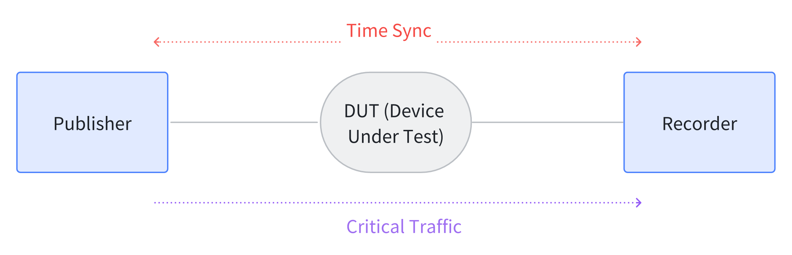
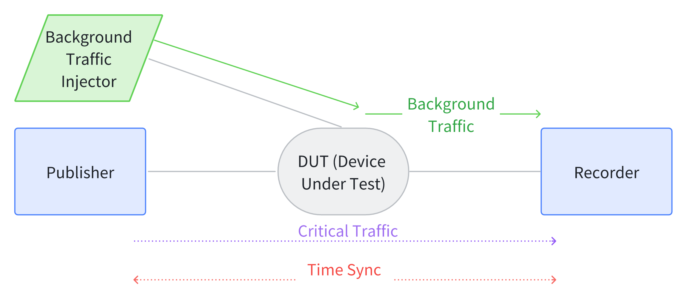

# TSNPerf 检测内容及使用表 
## 流量整形测试

本节将介绍使用TSNPerf测试待测设备流量整形功能的方法。本章节中的测试参数均为参考配置，使用者可根据实际需求修改参数。

### 基准测试

**目的：** 测试 **无** 背景流量情况下，高优先级流量经过一跳交换机（待测设备）的端到端延迟、抖动和丢包率。

**方案：**
使用如下拓扑，按照配置文档中的介绍发送关键数据包，记录关键数据包的端到端时延、抖动和丢包率。



下面给出TSNPerf程序的参考参数配置：
```bash
mode:                   0
tx-mode:                2
verbose:                true
use-ziggo-analysis:     false
pcap-filename:          "/home/i210/launchtimedemo/captured_10w_1500Byte.pcap"
interface:              "enp1s0"
smac:                   "00:1b:21:77:ac:ae"
dmac:                   "00:1b:21:76:ae:75"
ethertype:              0xb62c
socket-priority:        0
vlan-priority:          0
offset:                 150000
early-offset:           300000
use-launchtime:         true
basetime:               1684559640000000100L
packet-size:            1500
packets-to-send:        10000
interval:               1000000
use-udp:                false
sip:                    "192.168.16.10"
dip:                    "192.168.16.11"
sport:                  10000
dport:                  10000
```

该配置中，`packet-size`可以根据需要改变，推荐可以设置为 64 Byte（最小以太网帧长）、100 Byte、500 Byte、1000 Byte、1500 Byte等。

每一个关键数据包中，从第26个字节开始的8个字节是数据包的发送时间戳，用tcpdump抓取对应的接收时间戳，进而求得每个数据包的端到端时延。统计发送出的10000个数据包，可以得到平均时延和抖动（方差/标准差），以及丢包率。

### 门控能力

**目的：** 测试**有**背景流量情况下，高优先级流量经过一跳交换机（待测设备）的端到端延迟、抖动和丢包率。

**方案：** 使用如下拓扑进行测试。从Injector向Recorder发送背景流量，同时从Publisher向Recorder发送关键流量，记录关键数据包的端到端时延、抖动和丢包率。



为了全面测试待测设备地门控能力，可以调整Injector向网络中注入的背景流量带宽，以千兆网络为例，可以分别检查背景流量为 250 Mbps、500 Mbps、750 Mbps、1000 Mbps的情况下，关键数据包的时延抖动。

TSNPerf程序的配置参数可参考上一小节。如果待测设备功能正常，则测试结果应与**基准测试**中得到的结果一致。

### 门控精度

**目的：** 测试交换机门控的精度，即能否通过预期数量和大小的以太网帧

**方案：** 每个周期预留16384ns的门控给关键流量，理论上每个周期可以通过2个1500Byte的以太网帧。

下面给出TSNPerf程序的参考参数配置：
```bash
mode:                   0
tx-mode:                3
verbose:                true
use-ziggo-analysis:     false
pcap-filename:          "/home/i210/launchtimedemo/captured_10w_1500Byte.pcap"
interface:              "enp1s0"
smac:                   "00:1b:21:77:ac:ae"
dmac:                   "00:1b:21:76:ae:75"
ethertype:              0xb62c
socket-priority:        0
vlan-priority:          0
offset:                 150000
early-offset:           300000
use-launchtime:         false
basetime:               1684559640000000100L
packet-size:            1500
packets-to-send:        100000
interval:               1000000
use-udp:                false
sip:                    "192.168.16.10"
dip:                    "192.168.16.11"
sport:                  10000
dport:                  10000
```

Publisher向Recorder打满关键流量，Recorder处统计接收到的关键数据包的时间戳。预期每个周期（1毫秒）可以接收到两个关键数据包。

另外，还可以在不同的拓扑下，更细粒度地验证待测设备的门控精度。在下图拓扑上，以千兆以太网、1500Byte测试包为例，我们配置 DUT1 在周期的 0~16us 打开关键流量门控，DUT2 在周期的 15~31us 打开关键流量门控吗。期望，关键数据包能够不丢包地通过网络设备，并且端到端时延与门控全开时的结果一致。


### 带宽保障

**目的：** 测试待测交换机是否可以为关键流量预留固定的带宽

**方案：** 
1. 配置待测交换机的门控，为关键数据预留25%、50%、75%的带宽。
2. 从Injector处向Recorder打满背景流量。
3. 用TSNPerf，从Publisher向Recorder发送关键流量，配置参数可参考上一小节。
4. Recorder处用tcpdump/wireshark记录带宽使用情况。以千兆带宽为例，预期关键数据会分别占用 250Mbps、500Mbps、750Mbps 的带宽。

### 视频流量测试

**目的：** 测试以太网帧大小不同的视频流量经过一跳交换机的端延迟、抖动和丢包率

**方案：** 测试拓扑参考**基准测试**章节。准备好一个视频流量的pcap文件`H264.pcap`，TSNPerf程序的参数配置如下：
```bash
mode:                   0
tx-mode:                0
verbose:                true
use-ziggo-analysis:     false
pcap-filename:          "/home/i210/launchtimedemo/H264.pcap"
interface:              "enp1s0"
smac:                   "00:1b:21:77:ac:ae"
dmac:                   "00:1b:21:76:ae:75"
ethertype:              0xb62c
socket-priority:        0
vlan-priority:          0
offset:                 150000
early-offset:           300000
use-launchtime:         true
basetime:               1684559640000000100L
packet-size:            1500
packets-to-send:        10000
interval:               1000000
use-udp:                true
sip:                    "192.168.16.10"
dip:                    "192.168.16.11"
sport:                  10000
dport:                  10000
```
如果待测交换机是存储转发（store-and-forward）模式的，则预期每个数据包的端到端时延会因包的大小而有所不同。如果待测交换机是直通转发（cut-through）模式的，则预期数据包的端到端时延抖动是很小的。

## 超参数汇总

除了上文中给的TSNPerf程序配置，还有一些参数在测试用例中经常需要根据需求改动，现将之罗列于下：

* packet-size：该参数设置了测试包的大小，用于验证待测设备转发不同数据包的能力。推荐的配置有：64 Byte（最小以太网帧长）、100 Byte、500 Byte、1000 Byte、1500 Byte等。
* 背景流量大小：该参数设置了网络中的背景流量大小，用于验证待测设备能否保障关键流量的低延迟、低抖动传输。可以根据实际网络带宽的大小，配置背景流量分别占用 0%、25%、50%、75%、100% 的网络带宽。
* 拓扑：拓扑决定了关键流量在网络中的传输路径。在不同拓扑上测试可以更加全面地验证待测设备的门控能力、门控精度。本文限于篇幅，仅使用了 一跳测试拓扑 和 两跳测试拓扑，使用者可以根据需要，改变测试拓扑。
