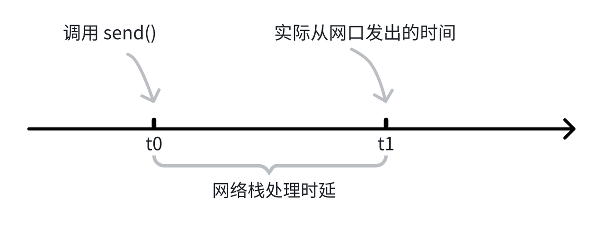

# TSNPerf 设计原理
## 现有方案的局限

TSNPerf是一款专为时间敏感网络（Time-Sensitive Networking, TSN）设计的性能评测工具。它提供了全面的TSN网络性能评测功能，能够帮助网络工程师和研究人员深入了解并验证TSN网络设备的性能特征。为此，TSNPerf需要能够精准地向网络中发送关键数据包，以测试设备的时间同步性能和流量整形能力。然而，Linux操作系统提供的`send()`函数只能达到微秒级的发包精度，难以满足TSNPerf对高精度发包的要求。

为了直观地展示`send()`函数的发包精度限制，我们进行了一项测试。在测试中，我们使用`send()`函数以1毫秒为设定间隔，连续发送了10000个数据包。然后，我们记录了每两个相邻数据包之间的实际时间间隔，并计算了它们与预期的1毫秒间隔之间的误差。结果显示，即使没有任何背景进程/流量的干扰，相邻数据包的间隔任然达到了***最高14微秒***左右。接下来我们分析该现象的原因。

如下图所示，在 $t_0$ 时刻，程序调用 `send()` 函数向网络发送数据包，但实际上，数据包在 $t_1$ 时刻才会被发送到网络中去。这是因为，操作系统的网络协议栈需要花费一定的时间处理该数据包。我们将 $t_1-t_0$ 称之为网络栈的处理时延，这个时延通常在微秒级别。

## 解决方案

Intel 的 I210 / I225 / I226 网卡，提供了 LaunchTime 功能，可以精准地控制数据包离开网口的时间（理论精度在 32 纳秒级别）。

利用 LaunchTime，可以提高数据包的发送精度。如上图所示，对于一个需要在 $t_0$ 时刻发出的数据包，我们预留一段时间给网络栈的处理流程，提前在 $t_2$ 时刻就调用 `send()` 函数，保证数据包在 $t_0$ 前就在网卡的出队列口等待，LaunchTime 会在$t_0$时刻打开出队列的门，将数据包发出。

## 性能验证

类似地，我们开启 LaunchTime 功能，以1毫秒为设定间隔连续发送10000个数据包，记录每两个相邻数据包之间的实际时间间隔与1毫秒之间的误差。
结果如下图所示，所有数据包的发送时间误差不超过100纳秒，达到了TSNPerf对发包精度的要求

